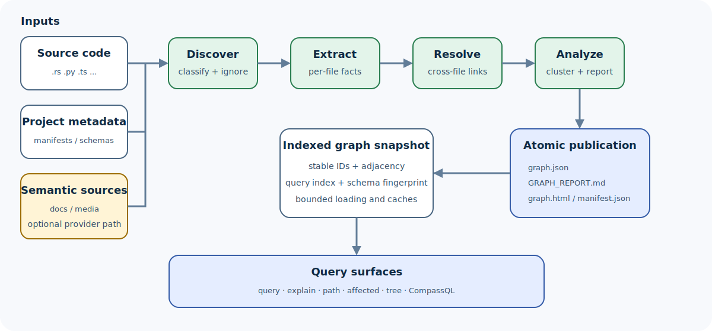

# Compass

**A fast, local-first knowledge graph for understanding codebases.**

Compass turns source code and project artifacts into a graph you can search,
query, visualize, compare across Git history, and share with development tools.

```text
large codebase
     |
     v
  Compass  ----->  architecture map
     |           \-> dependency and impact answers
     |            \-> exact CompassQL results
     |             \-> historical graph diffs
     |              \-> focused context for assistants
     v
less searching, smaller context, traceable evidence
```

[Get started](docs/getting-started.md) ·
[Read the documentation](docs/README.md) ·
[Explore the roadmap](docs/roadmap.md) ·
[View releases](https://github.com/crabbuild/compass/releases)

## What Compass gives you

| Need | Compass capability |
| --- | --- |
| Understand an unfamiliar repository | Communities, architecture reports, god-node detection, and interactive HTML |
| Find implementation paths | Natural-language graph discovery, symbol explanations, and directed paths |
| Estimate change impact | Reverse dependency traversal and version-to-version topology diffs |
| Automate structural checks | Deterministic, read-only [CompassQL](docs/COMPASSQL.md) with JSON and JSONL output |
| Ask questions about old revisions | Immutable graph realizations for exact Git commits |
| Give assistants focused context | Native skills, hooks, MCP serving, and compact graph queries |
| Connect other tools | Graph JSON, GraphML, SVG, Wiki, Obsidian, Neo4j, FalkorDB, and other exports |

Structural extraction and graph queries run locally. They do not require
Python, embeddings, a vector database, model credentials, or runtime parser
downloads.

## How it works



Compass discovers project files, extracts entities and relationships, resolves
cross-file references, analyzes the resulting graph, and publishes one
consistent snapshot.

```text
function / class / file / document / schema object       node
CALLS / IMPORTS_FROM / USES / CONTAINS                   relationship
dense group of related nodes                             community
direct / resolved / uncertain evidence                   provenance
```

Relationships retain their direction, source location, and provenance:

```text
CheckoutHandler
    |
    +-- CALLS [EXTRACTED] --> authorizePayment()
    |                              |
    |                              +-- USES --> PaymentGateway
    |
    +-- CALLS [INFERRED]  --> reserveInventory()
```

Read [How Compass works](docs/concepts/how-it-works.md) for the complete
pipeline and [Graph model](docs/concepts/graph-model.md) for the data model.

## Inspired by Graphify, extended by Compass

Compass is inspired by and modeled after
[Graphify](https://github.com/Graphify-Labs/graphify). Graphify established the
core workflow: extract a codebase into a knowledge graph, analyze its
communities, and use focused graph queries to navigate complex projects.

Compass gives explicit credit to that foundation. A frozen Graphify release is
still used as a behavioral oracle for compatible commands, graph structures,
and output contracts.

```text
Graphify ideas and behavior
           |
           v
compatibility fixtures and differential checks
           |
           v
Compass: native Rust engine
           |
           +--> preserves proven graph workflows
           +--> adds Compass-specific capabilities
           +--> evolves independently where the products diverge
```

### What Compass adds beyond the frozen Graphify baseline

| Area | Compass extension |
| --- | --- |
| Runtime | One native Rust executable; Python is used only by development parity tests |
| Exact queries | CompassQL, a deterministic and bounded read-only openCypher subset |
| Versioned graphs | Immutable realizations for exact commits, historical queries, exports, and diffs |
| Incremental operation | Reuses compatible unchanged extraction work and atomically publishes graph plus manifest |
| Query safety | Explicit row, path, expansion, memory, and time limits |
| Native distribution | Linked parsers and native implementations for supported graph, media, database, and service boundaries |

Compatibility is a foundation, not a permanent feature ceiling. Compass may
diverge when native design, performance, safety, or new workflows benefit from
a different contract. See [Compatibility](COMPATIBILITY.md) and
[Migration from Graphify](MIGRATION.md) for exact boundaries.

## Performance improvements over Graphify

Compass is qualified against the frozen Python Graphify oracle on copied
corpora. Results are accepted only when graph topology and read outputs match
the oracle.

The current large-corpus baseline contains 850 files, 15,151 nodes, and 38,374
edges. It was recorded on an Apple M2 Max with 32 GiB RAM using five independent
corpus copies.

| Large-corpus case | Graphify median | Compass median | Compass speedup |
| --- | ---: | ---: | ---: |
| Cold AST build | 10.766 s | 3.774 s | **2.85×** |
| Unchanged update | 12.180 s | 0.232 s | **52.5×** |
| One-file change | 12.155 s | 2.112 s | **5.8×** |
| Query | 0.746 s | 0.132 s | **5.7×** |
| Path | 0.655 s | 0.107 s | **6.1×** |
| Explain | 0.609 s | 0.087 s | **7.0×** |
| Affected analysis | 0.250 s | 0.034 s | **7.4×** |

On the same large corpus, cold-build peak memory fell from 351.3 MiB to
291.2 MiB. The qualification gate also checks warm updates, edits, renames,
deletes, query output, and memory use.

These numbers are a reproducible local baseline, not a universal promise for
every repository or machine. Read [Performance qualification](PERFORMANCE.md)
for hardware details, raw-evidence rules, regression gates, and benchmark
commands.

## Quick start

### 1. Install

On macOS (Apple Silicon or Intel):

```bash
curl --proto '=https' --tlsv1.2 -LsSf \
  https://github.com/crabbuild/compass/releases/latest/download/install.sh | sh
```

Or build from source with the pinned Rust 1.97.1+ toolchain:

```bash
git clone https://github.com/crabbuild/compass.git
cd compass
cargo install --locked --path crates/compass-cli --bin compass
```

### 2. Build a local graph

```bash
cd your-project
compass update .
```

Compass writes:

```text
compass-out/
├── graph.json        machine-readable graph
├── GRAPH_REPORT.md   architecture and community summary
├── graph.html        interactive visualization when size permits
└── manifest.json     incremental build state
```

### 3. Ask useful questions

```bash
compass query "where is authentication enforced?"
compass explain TokenVerifier
compass path ApiHandler TokenVerifier
compass affected TokenVerifier --depth 3
```

These commands read the saved graph and do not call a model.

## Compass-specific workflows

### Query exact graph patterns with CompassQL

```bash
compass query --cql \
  "MATCH (caller)-[:CALLS]->(target)
   WHERE target.label = 'authorizePayment()'
   RETURN caller.id, target.id
   LIMIT 20" \
  --format json
```

CompassQL is deterministic, read-only, parameterized, and resource-bounded.
See the [language contract](docs/COMPASSQL.md) and
[support matrix](docs/COMPASSQL_SUPPORT.md).

### Travel through graph history

```bash
compass history enable --code-only
compass history build HEAD
compass query "authentication" --at HEAD~20
compass diff HEAD~1 HEAD --topology-only
```

Historical builds use exact Git commits and immutable extraction
fingerprints. Current and historical graphs can be queried, compared, and
exported without putting generated graph data into Git.

Read the [versioned history guide](docs/guides/versioned-history.md) and
[storage design](docs/design/storage-and-history.md).

### Connect a coding assistant

```bash
compass install --project --platform codex
```

The installed Compass skill teaches supported assistants to start from the
architecture report, request a focused subgraph, and open only the source files
needed to verify an answer.

```text
architecture question
        |
        v
read GRAPH_REPORT.md
        |
        v
run a focused Compass query
        |
        v
inspect the smallest useful source set
```

See [Assistant setup](docs/guides/assistant-setup.md) for supported platforms,
scope, strict mode, upgrades, and uninstall.

## Structural and semantic modes

Choose the smallest mode that answers your question:

| Command | Network behavior | Best for |
| --- | --- | --- |
| `compass update .` | Local only | Normal source-code graph updates |
| `compass extract . --code-only` | Local only | Explicit no-model extraction |
| `compass extract . --code-only --cargo` | Local only | Code plus Cargo dependency edges |
| `compass extract docs --backend …` | Uses the configured provider | Semantic facts from supported documents and media |

Semantic extraction is optional. Compass contacts a model provider only when
you select a provider-backed workflow. Read
[Security and privacy](docs/design/security-and-privacy.md) before processing
sensitive repositories.

## Find the right document

| You are… | Start here |
| --- | --- |
| Evaluating Compass | [Getting started](docs/getting-started.md) → [How it works](docs/concepts/how-it-works.md) |
| Using or integrating Compass | [Guides](docs/README.md#complete-a-task) → [Cookbook](docs/cookbook/README.md) |
| Extending the Rust workspace | [Architecture](docs/design/architecture.md) → [Workspace tour](docs/implementation/workspace-tour.md) |
| Looking up an interface | [Commands](docs/reference/commands.md) → [Outputs](docs/reference/outputs.md) |
| Tracking future direction | [Available, planned, and aspirational roadmap](docs/roadmap.md) |

The [documentation hub](docs/README.md) links every concept, guide, design,
implementation note, recipe, and reference.

## Community and contributing

| Need | Destination |
| --- | --- |
| Usage question or idea | [GitHub Discussions](https://github.com/crabbuild/compass/discussions) |
| Bug or actionable feature request | [GitHub Issues](https://github.com/crabbuild/compass/issues/new/choose) |
| Security vulnerability | [Private vulnerability reporting](https://github.com/crabbuild/compass/security/advisories/new) |
| Code or documentation contribution | [Contributing guide](CONTRIBUTING.md) |

Development checks, architecture boundaries, and contribution expectations are
documented in [CONTRIBUTING.md](CONTRIBUTING.md). Support and disclosure
boundaries live in [SUPPORT.md](SUPPORT.md) and [SECURITY.md](SECURITY.md).

## License

Compass's original work is dual-licensed under
[MIT](LICENSE-MIT) or [Apache-2.0](LICENSE-APACHE).
Third-party components retain their original licenses; see
[THIRD_PARTY_NOTICES.md](THIRD_PARTY_NOTICES.md).
