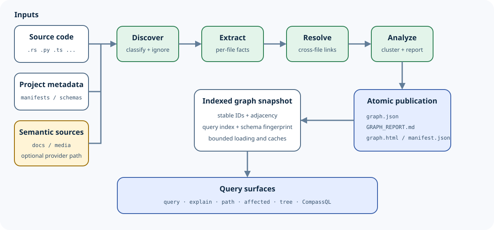

# Compass

**A fast, local-first knowledge graph for understanding codebases.**

Compass turns source code and project artifacts into a graph you can search,
query, visualize, compare across Git history, and share with development tools.

```text
large codebase
     |
     v
  Compass  ----->  architecture map
     |           \-> dependency and impact answers
     |            \-> exact CompassQL results
     |             \-> historical graph diffs
     |              \-> focused context for assistants
     v
less searching, smaller context, traceable evidence
```

[Get started](docs/getting-started.md) ·
[Read the documentation](docs/README.md) ·
[Explore the roadmap](docs/roadmap.md) ·
[View releases](https://github.com/crabbuild/compass/releases)

Use Compass inside your editor with the first-party
[VS Code extension guide](docs/guides/vscode.md): current graph, cursor-rooted
call graphs, architecture flow, queries, and exact Git evolution.

## What Compass gives you

| Need | Compass capability |
| --- | --- |
| Understand an unfamiliar repository | Communities, architecture reports, god-node detection, and interactive HTML |
| Find implementation paths | Natural-language graph discovery, symbol explanations, and directed paths |
| Estimate change impact | Reverse dependency traversal and version-to-version topology diffs |
| Automate structural checks | Deterministic, read-only [CompassQL](docs/COMPASSQL.md) with JSON and JSONL output |
| Ask questions about old revisions | Immutable graph realizations for exact Git commits |
| Give assistants focused context | Native skills, hooks, MCP serving, and compact graph queries |
| Connect other tools | Graph JSON, GraphML, SVG, Wiki, Obsidian, Neo4j, FalkorDB, and other exports |

Structural extraction and graph queries run locally. They do not require
Python, embeddings, a vector database, model credentials, or runtime parser
downloads.

## How it works



Compass discovers project files, extracts entities and relationships, resolves
cross-file references, analyzes the resulting graph, and publishes one
consistent snapshot.

```text
function / class / file / document / schema object       node
CALLS / IMPORTS_FROM / USES / CONTAINS                   relationship
dense group of related nodes                             community
direct / resolved / uncertain evidence                   provenance
```

Relationships retain their direction, source location, and provenance:

```text
CheckoutHandler
    |
    +-- CALLS [EXTRACTED] --> authorizePayment()
    |                              |
    |                              +-- USES --> PaymentGateway
    |
    +-- CALLS [INFERRED]  --> reserveInventory()
```

Read [How Compass works](docs/concepts/how-it-works.md) for the complete
pipeline and [Graph model](docs/concepts/graph-model.md) for the data model.

## Project lineage

Compass is inspired by and modeled after
[Graphify](https://github.com/Graphify-Labs/graphify). Graphify established the
core workflow: extract a codebase into a knowledge graph, analyze its
communities, and use focused graph queries to navigate complex projects.

Compass gives explicit credit to that foundation, but it is now an independent
product with its own implementation, commands, configuration, artifacts, and
test suite. Compass does not execute or depend on Graphify.

### Compass capabilities

| Area | Compass extension |
| --- | --- |
| Runtime | One native Rust executable with no Python or Graphify dependency |
| Exact queries | CompassQL, a deterministic and bounded read-only openCypher subset |
| Versioned graphs | Immutable realizations for exact commits, historical queries, exports, and diffs |
| Incremental operation | Reuses compatible unchanged extraction work and atomically publishes graph plus manifest |
| Query safety | Explicit row, path, expansion, memory, and time limits |
| Native distribution | Linked parsers and native implementations for supported graph, media, database, and service boundaries |

See [Compatibility](COMPATIBILITY.md) for Compass-owned contracts and
[Migration from Graphify](MIGRATION.md) for the one-time hard cutover.

## Performance

Compass performance is qualified against Compass-owned baselines while
preserving graph correctness and deterministic output. Read
[Performance qualification](PERFORMANCE.md) for the evidence policy and
benchmark commands.

## Quick start

### 1. Install

On macOS or Linux (Apple Silicon/ARM64 or Intel/AMD64):

```bash
curl --proto '=https' --tlsv1.2 -LsSf \
  https://github.com/crabbuild/compass/releases/latest/download/install.sh | sh
```

On Windows, download the x86_64 or ARM64 archive and matching `.sha256`
file from the [latest release](https://github.com/crabbuild/compass/releases/latest),
verify the checksum, extract it, and add the directory containing
`compass.exe` to `PATH`.

Or build from source with the pinned Rust 1.97.1+ toolchain:

```bash
git clone https://github.com/crabbuild/compass.git
cd compass
make install
```

`make install` uses an existing `~/.cargo/bin`, otherwise it creates and uses
`~/.local/bin`. To choose another location, run
`make install BINDIR="$HOME/bin"`.

You can also install directly through Cargo:

```bash
cargo install --locked --path crates/compass-cli --bin compass
```

### 2. Initialize and build a local graph

```bash
cd your-project
compass init
```

`compass init` previews the eligible corpus, saves project scope in
`.compass/config.toml`, and performs the first structural build. For automation
or a focused monorepo scope:

```bash
compass init . --include src --include 'services/*/src' --exclude '**/generated/**' --yes
```

After setup, `compass update` and `compass watch` automatically reuse the
saved scope.

Compass writes:

```text
compass-out/
├── graph.json        machine-readable graph
├── GRAPH_REPORT.md   architecture and community summary
├── graph.html        interactive visualization when size permits
└── manifest.json     incremental build state
```

### 3. Ask useful questions

```bash
compass query "where is authentication enforced?"
compass explain TokenVerifier
compass path ApiHandler TokenVerifier
compass affected TokenVerifier --depth 3
```

These commands read the saved graph and do not call a model.

## Compass-specific workflows

### Query exact graph patterns with CompassQL

```bash
compass query --cql \
  "MATCH (caller)-[:CALLS]->(target)
   WHERE target.label = 'authorizePayment()'
   RETURN caller.id, target.id
   LIMIT 20" \
  --format json
```

CompassQL is deterministic, read-only, parameterized, and resource-bounded.
See the [language contract](docs/COMPASSQL.md) and
[support matrix](docs/COMPASSQL_SUPPORT.md).

### Travel through graph history

```bash
compass history enable --code-only
compass history build main
compass history build HEAD --profile-from main
compass query "authentication" --at HEAD~20
compass diff main HEAD
compass diff main HEAD --format html --output semantic-diff.html
```

Historical builds use exact Git commits and immutable extraction
fingerprints. Current and historical graphs can be queried, compared, and
exported without putting generated graph data into Git. Semantic diff leads
with likely breaks, behavior changes, affected callers/modules, and test
evidence; use `--all` to expand routine symbol churn.
Default text output reports any findings beyond its display budget; use
`--limit N` to raise that budget or `--all` for exhaustive output.
HTML output is a self-contained interactive reviewer report with semantic
findings, an enhanced unified/split source diff, and a changed-subgraph view
with exhaustive node/edge delta lists. The source view is rendered by the
pinned `@pierre/diffs` library and retains the exact Git patch as an offline
fallback. HTML output requires an explicit `--output` path.

Read the [versioned history guide](docs/guides/versioned-history.md) and
[storage design](docs/design/storage-and-history.md).

### Connect a coding assistant

```bash
compass install
```

Inside a Git repository, Compass detects installed coding agents and configures
them at the repository root. Codex, Gemini CLI, OpenCode, Copilot, and generic
Agent Skills clients share one portable `.agents/skills/compass` package;
Claude Code, Kiro, and Cline use their native skill roots. Use repeatable
`--platform` flags when you want explicit selection:

```bash
compass install --platform codex --platform claude
compass install --all --dry-run
compass install --user --format json
```

The skill teaches assistants to use an existing Compass graph as the first
navigation layer, request a focused subgraph, and open only the source files
needed to verify an answer. Installation does not build a graph.

```text
architecture question
        |
        v
read GRAPH_REPORT.md
        |
        v
run a focused Compass query
        |
        v
inspect the smallest useful source set
```

See [Assistant setup](docs/guides/assistant-setup.md) for supported platforms,
scope, strict mode, upgrades, and uninstall.

### Inspect program behavior with evidence

Native `update`, `extract`, and `watch` builds also write `program.json`, a
language-neutral Program IR containing functions, conservative basic blocks,
operations, call candidates, capability coverage, provenance, and derived
summaries. The offline-first pipeline combines Tree-sitter syntax evidence for
Rust and TypeScript-family languages with any SCIP indexes already on disk.
Compass does not invoke an indexer, compiler, language server, model, or network
service to build this artifact.

Schema `http://crab.build/compass/v1` reports each capability as `complete`,
`partial`, `indeterminate`, or `failed`, with machine-readable reasons for
every non-complete state. Unresolved calls are retained as uncertainty and are
never treated as proof that no downstream target exists.

Inspect or query the current artifact without custom JSON scripts:

```bash
compass program summary
compass program coverage
compass program functions --language rust --name build
compass program show <symbol-id>
compass program callers <symbol-id>
compass program explain-call src/lib.rs:240
compass program query \
  "MATCH (f) WHERE f.kind = 'program_function' RETURN f LIMIT 20"
```

Supply additional offline evidence with repeatable
`--program-artifact path/to/index.scip` options. Decoded indexes are cached by
artifact digest, while freshness and normalization are invalidated per indexed
document.

## Structural and semantic modes

Choose the smallest mode that answers your question:

| Command | Network behavior | Best for |
| --- | --- | --- |
| `compass update .` | Local only | Normal source-code graph updates |
| `compass extract . --code-only` | Local only | Explicit no-model extraction |
| `compass extract . --code-only --cargo` | Local only | Code plus Cargo dependency edges |
| `compass extract docs --backend …` | Uses the configured provider | Semantic facts from supported documents and media |

Semantic extraction is optional. Compass contacts a model provider only when
you select a provider-backed workflow. Read
[Security and privacy](docs/design/security-and-privacy.md) before processing
sensitive repositories.

## Find the right document

| You are… | Start here |
| --- | --- |
| Evaluating Compass | [Getting started](docs/getting-started.md) → [How it works](docs/concepts/how-it-works.md) |
| Using or integrating Compass | [Guides](docs/README.md#complete-a-task) → [Cookbook](docs/cookbook/README.md) |
| Extending the Rust workspace | [Architecture](docs/design/architecture.md) → [Workspace tour](docs/implementation/workspace-tour.md) |
| Looking up an interface | [Commands](docs/reference/commands.md) → [Outputs](docs/reference/outputs.md) |
| Tracking future direction | [Available, planned, and aspirational roadmap](docs/roadmap.md) |

The [documentation hub](docs/README.md) links every concept, guide, design,
implementation note, recipe, and reference.

## Community and contributing

| Need | Destination |
| --- | --- |
| Usage question or idea | [GitHub Discussions](https://github.com/crabbuild/compass/discussions) |
| Bug or actionable feature request | [GitHub Issues](https://github.com/crabbuild/compass/issues/new/choose) |
| Security vulnerability | [Private vulnerability reporting](https://github.com/crabbuild/compass/security/advisories/new) |
| Code or documentation contribution | [Contributing guide](CONTRIBUTING.md) |

Development checks, architecture boundaries, and contribution expectations are
documented in [CONTRIBUTING.md](CONTRIBUTING.md). Support and disclosure
boundaries live in [SUPPORT.md](SUPPORT.md) and [SECURITY.md](SECURITY.md).

## License

Compass's original work is dual-licensed under
[MIT](LICENSE-MIT) or [Apache-2.0](LICENSE-APACHE).
Third-party components retain their original licenses; see
[THIRD_PARTY_NOTICES.md](THIRD_PARTY_NOTICES.md).
