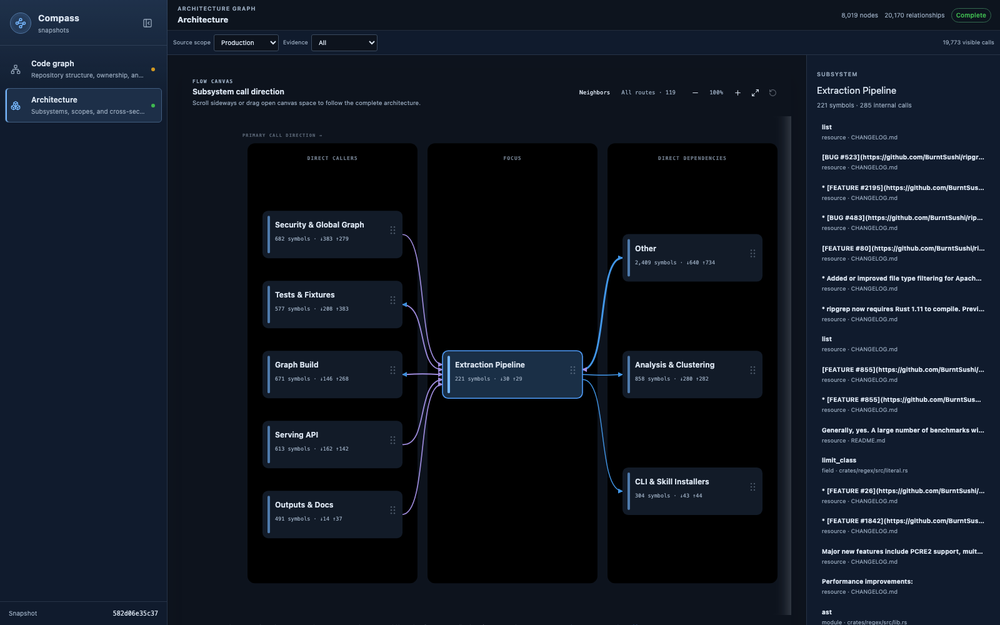
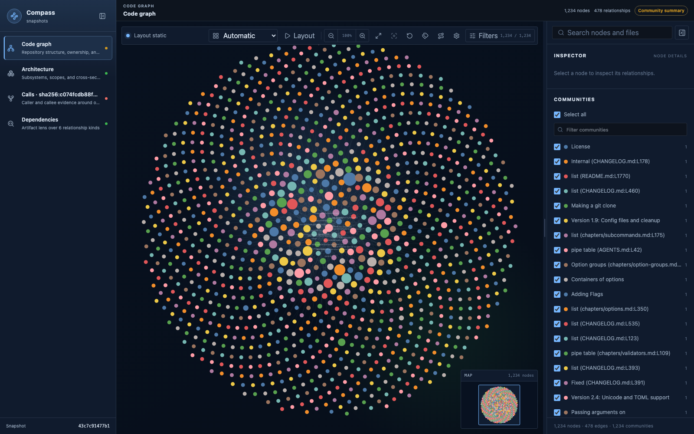
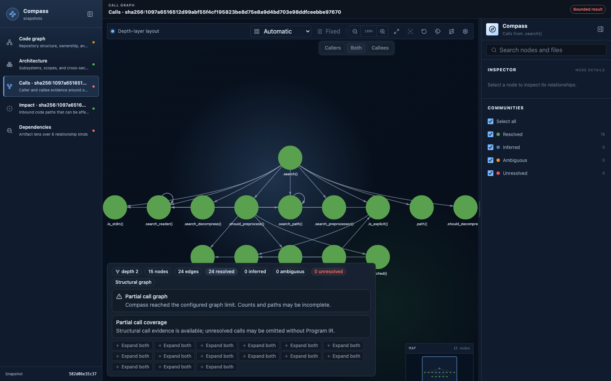
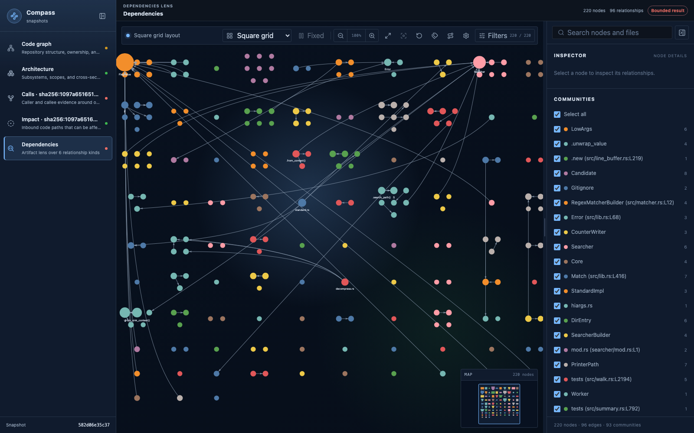

<p align="center">
  
</p>

<h1 align="center">Compass</h1>

<div align="center">
  <p><strong>Understand the shape of a codebase before you change it.</strong></p>
  <p>Compass is a local-first Rust workbench for architecture maps, dependency paths, impact analysis, and Git history.</p>
  <p>
    <a href="docs/getting-started.md">Get started</a> ·
    <a href="docs/README.md">Documentation</a> ·
    <a href="docs/roadmap.md">Roadmap</a> ·
    <a href="https://marketplace.visualstudio.com/items?itemName=crabbuild.crabbuild-compass-vscode">VS Code extension</a> ·
    <a href="https://github.com/crabbuild/compass/releases">Releases</a>
  </p>
</div>

<p align="center">
  <a href="https://github.com/crabbuild/compass/actions/workflows/compass-ci.yml"></a>
  <a href="https://github.com/crabbuild/compass/releases"></a>
  <a href="https://github.com/crabbuild/compass/blob/main/LICENSE-MIT"></a>
</p>

Compass turns source code and project artifacts into a directed, queryable knowledge graph. It gives people and coding assistants a shared map of symbols, files, communities, relationships, and evidence.

```text
large codebase
     |
     v
  Compass  ----->  architecture map
     |           \-> dependency and impact answers
     |            \-> exact CompassQL results
     |             \-> historical graph diffs
     |              \-> focused context for assistants
     v
less searching, smaller context, traceable evidence
```

## What Compass gives you

Compass covers the path from repository orientation to verified automation:

| Need | Compass capability |
| --- | --- |
| Understand an unfamiliar repository | Communities, architecture reports, god-node detection, and interactive HTML |
| Find implementation paths | Natural-language graph discovery, symbol explanations, and directed paths |
| Estimate change impact | Reverse dependency traversal and version-to-version topology diffs |
| Automate structural checks | Deterministic, read-only [CompassQL](docs/COMPASSQL.md) with JSON and JSONL output |
| Ask questions about old revisions | Immutable graph realizations for exact Git commits |
| Give assistants focused context | Native skills, hooks, MCP serving, and compact graph queries |
| Connect other tools | Graph JSON, GraphML, SVG, Wiki, Obsidian, Neo4j, FalkorDB, and other exports |

Structural extraction and graph queries run locally. They do not require Python, embeddings, a vector database, model credentials, or runtime parser downloads.

## See the graph before you open every file

Compass exports a self-contained workbench. Move from a repository map to subsystem flow, call evidence, or bounded dependency neighborhoods without changing snapshots.

<table>
  <tr>
    <td width="50%">
      
      <br><sub><strong>Architecture map · ripgrep</strong><br>Subsystem boundaries, call direction, and source-backed details.</sub>
    </td>
    <td width="50%">
      
      <br><sub><strong>Repository map · CLI11</strong><br>Large-scale structure with communities, filters, and a minimap.</sub>
    </td>
  </tr>
  <tr>
    <td width="50%">
      
      <br><sub><strong>Call graph · ripgrep</strong><br>Follow callers, callees, direction, depth, and evidence coverage.</sub>
    </td>
    <td width="50%">
      
      <br><sub><strong>Dependency lens · ripgrep</strong><br>Inspect bounded relationships while keeping the surrounding context visible.</sub>
    </td>
  </tr>
</table>

These are real Compass exports from public repositories, not product mockups: [BurntSushi/ripgrep](https://github.com/BurntSushi/ripgrep/tree/435f59fc4b43af3ab32f34d53fa34978f393fe52) and [CLIUtils/CLI11](https://github.com/CLIUtils/CLI11/tree/60492bddb50422f32cfa33c1365b96ebee4205ca). Counts and visible symbols reflect those exact revisions and will change as the projects evolve.

## Find the answer at the right scale

| Question | Compass surface |
| --- | --- |
| Where does this subsystem live? | Communities, architecture flow, ownership, and source details |
| Which areas need attention first? | Communities, architecture reports, god-node detection, and interactive HTML |
| What calls this function? | Bounded caller and callee graphs with direction and depth controls |
| What could this change affect? | Reverse dependency paths, affected nodes, and evidence limits |
| Which files belong to this workflow? | Search, explanations, paths, and relationship filters |
| How do I automate structural checks? | Deterministic, read-only [CompassQL](docs/COMPASSQL.md) with JSON and JSONL output |
| What changed between revisions? | Immutable historical graphs and semantic diffs over exact Git commits |
| How do assistants stay focused? | Native skills, hooks, MCP serving, and compact graph queries |
| How do I share the result? | VS Code, self-contained HTML, JSON, GraphML, SVG, Wiki, Obsidian, Neo4j, FalkorDB, and MCP integrations |

## Start with one repository

### Install the CLI

On macOS or Linux, use the installer for Apple Silicon or Intel and AMD systems:

```bash
curl --proto '=https' --tlsv1.2 -LsSf \
  https://github.com/crabbuild/compass/releases/latest/download/install.sh | sh
```

On Windows, use the installer for x64 or ARM64 systems:

```powershell
irm https://github.com/crabbuild/compass/releases/latest/download/install.ps1 | iex
```

For an offline install, download the matching archive and `.sha256` file from the [latest release](https://github.com/crabbuild/compass/releases/latest), verify the checksum, extract the archive, and add the directory to `PATH`.

To build from source, use the pinned Rust 1.97.1 or newer toolchain:

```bash
git clone https://github.com/crabbuild/compass.git
cd compass
cargo install --locked --path crates/compass-cli --bin compass
```

You can also use the repository installer:

```bash
make install
```

`make install` uses `~/.cargo/bin` when it exists. Otherwise, it creates and uses `~/.local/bin`. Set `BINDIR` when you want a different destination:

```bash
make install BINDIR="$HOME/bin"
```

Upgrade an installed Compass executable with `compass upgrade`.

Compass reads a bounded static release manifest, verifies the selected archive size and SHA-256 digest, and checks the staged executable version before replacement. The upgrade path does not use the rate-limited GitHub REST API. When no newer release exists, the command exits successfully and reports the installed version.

### Build the first graph

```bash
cd your-project
compass init
```

`compass init` previews the eligible corpus, saves the project scope in `.compass/config.toml`, and performs the first structural build. Compass writes a coherent snapshot under `compass-out/`.

For a focused monorepo scope, pass include and exclude patterns during initialization:

```bash
compass init . --include src --include 'services/*/src' --exclude '**/generated/**' --yes
```

```text
compass-out/
├── graph.json        machine-readable graph
├── GRAPH_REPORT.md   architecture and community summary
├── orientation.json  bounded orientation for assistants
├── graph.html        interactive visualization when size permits
├── manifest.json     incremental build state
├── snapshots/        retained coherent build snapshots
├── current-snapshot  selected snapshot identifier
└── store/            SQLite query index when enabled
```

After setup, `compass update` and `compass watch` reuse the saved scope automatically.

Keep the graph current while you work:

```bash
compass watch
```

Run `compass watch` in a second terminal. It reuses the saved scope and refreshes the graph as files change.

### Put Compass in your daily loop

Use Compass as a local context layer for coding assistants. The complete loop is:

```bash
compass init
compass install
compass watch
```

Run `compass watch` in a second terminal. For a focused task, an installed assistant starts with `compass query "your_question_here"`. For a first session or broad repository orientation, it reads the bounded Agent Orientation at the start of `compass-out/GRAPH_REPORT.md`, then runs a focused query.

### Ask a focused question

```bash
compass query "where is authentication enforced?"
compass query "where is authentication enforced?" --text-budget 8000
compass query "where is authentication enforced?" --cursor 'query_cursor_token'
compass explain TokenVerifier
compass path ApiHandler TokenVerifier
compass affected TokenVerifier --depth 3
```

These commands read the saved graph locally. Results are bounded, read-only, and tied to graph evidence instead of a model-generated guess.

Plain-language `query` uses bounded structured discovery. Its text projection returns complete deterministic entries within the `--text-budget` value, which defaults to 2,000. Follow `next=query_cursor_token` with the unchanged question and options until `next=none`.

The cursor fails when semantic inputs, the selected graph, or the semantic result changes. The `--traverse`, `--budget`, and `--page` options retain the legacy traversal contract; CompassQL uses its own versioned contract.

### Open the workbench

```bash
compass export html
```

Build several perspectives into one self-contained page:

```bash
symbol_id="your_symbol_id"
compass export html \
  --code-graph \
  --architecture-graph \
  --call-graph "$symbol_id" \
  --impact-graph "$symbol_id"
```

The same workbench is available through the [Compass Codegraph extension for VS Code](https://marketplace.visualstudio.com/items?itemName=crabbuild.crabbuild-compass-vscode). Search for a symbol or file, select a node, inspect its evidence and relationships, then open the exact source location.

The exported page and VS Code graph use the same workbench shell. Switch among code, call, impact, affected, architecture, history, and artifact views without losing the snapshot context.

Use this sequence when you explore a graph:

1. Search for a symbol or file.
2. Select a node to inspect its source, signature, community, evidence, and relationships.
3. Open the source card, or double-click a located node, to jump to the exact code.
4. Filter communities or change the layout when you need a different level of detail.

The graph toolbar includes an exploration panel for isolating a selected neighborhood up to four hops deep. Follow incoming, outgoing, or both edge directions, adjust layout spacing, and use the minimap to keep your place. Press `?` in the graph to see camera and exploration shortcuts.

In VS Code, right-click inside a function to open callers, callees, impact, related symbols, or a path.

## Keep it local and traceable

Compass is built for teams that need useful structure without handing a repository to a remote service.

| Principle | What it means in practice |
| --- | --- |
| Native by default | Structural extraction and graph queries run in one Rust executable. They do not require Python, embeddings, a vector database, model credentials, or runtime parser downloads. |
| Evidence first | Relationships retain direction, source anchors, and provenance. Ambiguous matches remain visible as uncertainty. |
| Bounded by design | Query rows, paths, expansions, memory, and time stay within explicit limits. A limit is reported as a limit, not an empty result. |
| History without rewriting | Historical realizations use exact Git commits and immutable fingerprints. Current and past graphs can be queried, exported, and compared. |

Optional semantic workflows use a configured provider only when you select them. Read [Security and privacy](docs/design/security-and-privacy.md) before processing sensitive repositories.

## Connect your existing tools

### VS Code

Install [Compass Codegraph](https://marketplace.visualstudio.com/items?itemName=crabbuild.crabbuild-compass-vscode), open a repository, and use the Compass sidebar to initialize or open the graph. Cursor-rooted call graphs, architecture flow, queries, and Git evolution use the same snapshot model.

Read the [VS Code extension guide](docs/guides/vscode.md) for current graphs, cursor-rooted call graphs, architecture flow, queries, and exact Git evolution. You can also install the extension from a terminal:

```bash
code --install-extension crabbuild.crabbuild-compass-vscode
```

### Coding assistants

Install the portable Agent Skills integration or a host-specific adapter from the repository root:

```bash
compass install
compass install --platform codex
compass install --platform codex --platform claude
compass install --all --dry-run
compass install --user --format json
```

Inside a Git repository, `compass install` detects supported coding agents at the repository root and always includes the portable Agent Skills integration. Codex, Gemini CLI, OpenCode, Copilot, and generic Agent Skills clients share `.agents/skills/compass`; Claude Code, Kiro, and Cline use their native skill roots.

Check `Selected` in the command output:

1. If your intended host appears, start a new assistant session.
2. If the output lists only `agents`, use an explicit `--platform` selection.
3. In Codex, review and trust the hook under `/hooks`.
4. In Gemini CLI, run `/skills reload` after installation.

An explicit platform selection bypasses host detection. Installation configures the integration but does not build a graph.

The integration starts with a bounded orientation or focused query, checks completeness and ambiguity, and opens only the cited source needed for verification. It uses `compass watch` in a second terminal, or reports `compass update .` as a refresh fallback.

For a first session or broad repository orientation, the assistant reads only the bounded Agent Orientation at the start of `GRAPH_REPORT.md`, then runs a focused query. It checks direction, ambiguity, graph completeness, domain truncation, and pagination. Ambiguous seeds are retried by exact node ID.

```text
focused task ───────────────> focused query
first/broad orientation ────> bounded Agent Orientation ──> focused query
                                      |
                                      v
                 inspect completion and the smallest cited source set
```

Read the [assistant setup guide](docs/guides/assistant-setup.md) for supported platforms, scope, strict mode, upgrades, and uninstall.

### Graph exports and Model Context Protocol (MCP)

Use `compass export` for machine-readable graph JSON, GraphML, SVG, Wiki, Obsidian, Neo4j, and FalkorDB workflows. Use [`compass serve`](docs/guides/integrating-compass.md) when you want graph resources and tools inside a compatible MCP client.

Inspect the supported transports and authentication options before starting a server:

```bash
compass serve --help
```

The MCP surface exposes bounded graph resources and tools through the same local snapshot used by the CLI and VS Code. Read the [integration guide](docs/guides/integrating-compass.md) for transport setup, health checks, and client configuration.

### Program evidence

Structural graphs are the default. Add the optional language-neutral Program Intermediate Representation (Program IR) when a workflow needs functions, conservative basic blocks, operations, call candidates, capability coverage, or derived summaries:

```bash
compass update . --program
compass program summary
compass program coverage
compass program functions --language rust --name build
```

Native `init`, `update`, `extract`, and `watch` builds publish the structural graph by default. Pass `--program` when a workflow needs `program.json`; repeat `--program-artifact` to add offline evidence artifacts.

The offline-first pipeline combines Tree-sitter syntax evidence for Rust and TypeScript-family languages with any Source Code Intelligence Protocol (SCIP) indexes already on disk. Compass does not invoke an indexer, compiler, language server, model, or network service to build this artifact.

The schema `http://crab.build/compass/v1` reports each capability as `complete`, `partial`, `indeterminate`, or `failed`. Each non-complete state includes machine-readable reasons. Unresolved calls remain uncertainty; Compass never treats them as proof that no downstream target exists.

Inspect or query the current artifact without custom JSON scripts:

```bash
symbol_id="your_symbol_id"
compass program summary
compass program coverage
compass program functions --language rust --name build
compass program show "$symbol_id"
compass program callers "$symbol_id"
compass program explain-call src/lib.rs:240
compass program query \
  "MATCH (f) WHERE f.kind = 'program_function' RETURN f LIMIT 20"
```

Decoded indexes are cached by artifact digest. Freshness and normalization are invalidated per indexed document. Supply additional offline evidence with repeatable `--program-artifact path/to/index.scip` options.

## Compare history, not memory

```bash
compass history enable --code-only
compass history build main
compass history build HEAD --profile-from main
compass query "authentication" --at HEAD~20
compass diff main HEAD
compass diff main HEAD --format html --output semantic-diff.html
```

Historical builds use exact Git commits and immutable extraction fingerprints. Current and historical graphs can be queried, compared, and exported without putting generated graph data into Git.

`compass diff` surfaces likely breaks, behavior changes, affected callers and modules, test evidence, and known limitations in one offline report. Use `--all` to include routine symbol churn. Use `--limit number_of_findings` to raise the text display budget.

HTML output is a self-contained interactive reviewer report. It includes semantic findings, an enhanced unified and split source diff, and a changed-subgraph view with exhaustive node and edge delta lists. The source view uses the pinned `@pierre/diffs` library and retains the exact Git patch as an offline fallback. HTML output requires an explicit `--output` path.

Read the [versioned history guide](docs/guides/versioned-history.md) and [storage design](docs/design/storage-and-history.md) for retention, profiles, and compatibility details.

## Performance

Compass maintains qualified performance baselines while preserving deterministic graph output and correctness. See [Performance qualification](PERFORMANCE.md) for the evidence policy and benchmark commands.

## How it works


Compass discovers project files, extracts entities and relationships, resolves cross-file references, analyzes communities, and publishes one consistent snapshot.

```text
function / class / file / document / schema object  → node
CALLS / IMPORTS_FROM / USES / CONTAINS              → relationship
dense group of related nodes                         → community
direct / resolved / uncertain evidence               → provenance
```

The graph keeps relationship direction, source location, and provenance together:

```text
CheckoutHandler
    |
    +-- CALLS [EXTRACTED] --> authorizePayment()
    |                              |
    |                              +-- USES --> PaymentGateway
    |
    +-- CALLS [INFERRED]  --> reserveInventory()
```

Read [How Compass works](docs/concepts/how-it-works.md) for the full pipeline and [Graph model](docs/concepts/graph-model.md) for the data contract.

## Query exact graph patterns with CompassQL

CompassQL is a deterministic, read-only, parameterized, and resource-bounded openCypher subset:

```bash
compass query --cql \
  "MATCH (caller)-[:CALLS]->(target)
   WHERE target.label = 'authorizePayment()'
   RETURN caller.id, target.id
   LIMIT 20" \
  --format json
```

Read the [language contract](docs/COMPASSQL.md) and [support matrix](docs/COMPASSQL_SUPPORT.md) for syntax, limits, and machine-readable output.

## Choose the smallest mode that answers the question

| Command | Network behavior | Best use |
| --- | --- | --- |
| `compass update .` | Local only | Normal source-code graph updates |
| `compass extract . --code-only` | Local only | Explicit no-model extraction |
| `compass extract . --code-only --cargo` | Local only | Code plus Cargo dependency edges |
| `compass extract docs --backend …` | Configured provider | Semantic facts from supported documents and media |

Compass gives explicit control over optional provider boundaries. Structural graph building remains local-first and independent of those providers.

## Project lineage and compatibility

Compass is inspired by and modeled after [Graphify](https://github.com/Graphify-Labs/graphify), which established the workflow of extracting a codebase into a knowledge graph, analyzing communities, and querying focused context.

Compass is now an independent product with its own Rust implementation, commands, configuration, artifacts, and test suite. It does not execute or depend on Graphify.

### Compass capabilities

| Area | What Compass does |
| --- | --- |
| Runtime | Runs structural extraction and graph queries in one native Rust executable |
| Exact queries | Provides CompassQL, a deterministic and bounded read-only openCypher subset |
| Versioned graphs | Keeps immutable realizations for exact commits, historical queries, exports, and diffs |
| Incremental operation | Reuses compatible unchanged extraction work and atomically publishes graph plus manifest |
| Query safety | Enforces explicit row, path, expansion, memory, and time limits |
| Native distribution | Links parsers and native implementations for supported graph, media, database, and service boundaries |

Read [Compatibility](COMPATIBILITY.md) for Compass-owned contracts and [Migration from Graphify](MIGRATION.md) for the one-time hard cutover.

## Find your next page

| You are… | Start here |
| --- | --- |
| Evaluating Compass | [Getting started](docs/getting-started.md) → [How it works](docs/concepts/how-it-works.md) |
| Using or integrating Compass | [Documentation hub](docs/README.md) → [Cookbook](docs/cookbook/README.md) |
| Extending the Rust workspace | [Architecture](docs/design/architecture.md) → [Workspace tour](docs/implementation/workspace-tour.md) |
| Looking up an interface | [Commands](docs/reference/commands.md) → [Outputs](docs/reference/outputs.md) |
| Tracking future direction | [Roadmap](docs/roadmap.md) |

The [documentation hub](docs/README.md) links every concept, guide, design, implementation note, recipe, and reference. Start with the [guides](docs/README.md#complete-a-task) when you have a concrete task to complete.

## Community and contributing

| Need | Destination |
| --- | --- |
| Usage question or idea | [GitHub Discussions](https://github.com/crabbuild/compass/discussions) |
| Bug or actionable feature request | [GitHub Issues](https://github.com/crabbuild/compass/issues/new/choose) |
| Security vulnerability | [Private vulnerability reporting](https://github.com/crabbuild/compass/security/advisories/new) |
| Code or documentation contribution | [Contributing guide](CONTRIBUTING.md) |

Development checks and architecture boundaries live in [CONTRIBUTING.md](CONTRIBUTING.md). Support and disclosure boundaries live in [SUPPORT.md](SUPPORT.md) and [SECURITY.md](SECURITY.md).

## License

Compass's original work is dual-licensed under [MIT](LICENSE-MIT) or [Apache-2.0](LICENSE-APACHE). Third-party components retain their original licenses; see [THIRD_PARTY_NOTICES.md](THIRD_PARTY_NOTICES.md).
