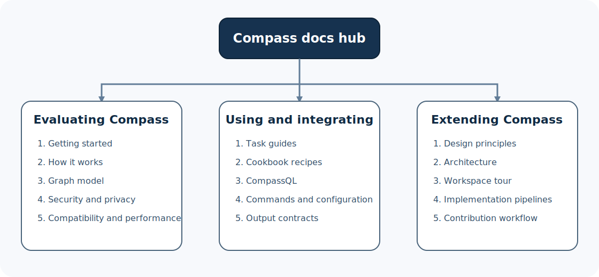

# Compass documentation

Compass is a native, local-first knowledge graph engine for source code and
project artifacts. It discovers the entities in a project, records how they
relate, and gives people and tools a smaller, structured way to explore a large
codebase.

> **Who this page is for:** evaluators, Compass users, integrators, and
> contributors.
>
> **You will learn:** where to start, which documents answer which questions,
> and which material describes current behavior versus future direction.
>
> **Prerequisites:** none.
>
> **Reading time:** about 5 minutes.

Compass was inspired by
[Graphify](https://github.com/Graphify-Labs/graphify), and its compatibility
suite still uses a frozen Graphify release as an important behavioral oracle.
Compass is not limited to being a port, however. It already includes
Compass-native capabilities, such as CompassQL and versioned graph history, and
its feature set is expected to evolve independently.



## Choose your path

### I am evaluating Compass

Start here if you want to understand the product before adopting it:

1. [Getting started](getting-started.md) — install Compass, build a graph, and
   answer a real question.
2. [How Compass works](concepts/how-it-works.md) — understand the pipeline
   without needing graph-database experience.
3. [Graph model](concepts/graph-model.md) — learn what nodes, relationships,
   communities, and provenance mean.
4. [Security and privacy](design/security-and-privacy.md) — see what stays
   local and when a configured provider may be contacted.
5. [Compatibility](../COMPATIBILITY.md) and
   [performance](../PERFORMANCE.md) — inspect the published evidence.

### I use or integrate Compass

Start with [Getting started](getting-started.md), then choose the task closest
to yours:

- [Explore an unfamiliar codebase](guides/exploring-a-codebase.md)
- [Integrate Compass with other tools](guides/integrating-compass.md)
- [Set up a coding assistant](guides/assistant-setup.md)
- [Use versioned graph history](guides/versioned-history.md)
- [Operate watch, serve, hooks, and providers](guides/operations.md)
- [Solve a concrete problem](cookbook/README.md)
- [Look up commands and contracts](reference/commands.md)

### I contribute to Compass

Read these in order when you need a durable mental model of the Rust
workspace:

1. [Design principles](design/principles.md)
2. [System architecture](design/architecture.md)
3. [Workspace and crate tour](implementation/workspace-tour.md)
4. [Extraction pipeline](implementation/extraction-pipeline.md)
5. [Query engine](implementation/query-engine.md)
6. [Semantic pipeline](implementation/semantic-pipeline.md)
7. [Extending Compass](implementation/extending-compass.md)
8. [Contributing](../CONTRIBUTING.md)

## Documentation map

### Learn the concepts

| Document | What it answers |
| --- | --- |
| [How Compass works](concepts/how-it-works.md) | How does a directory become a queryable graph? |
| [Graph model](concepts/graph-model.md) | What do the entities and relationships mean? |
| [Provenance](concepts/provenance.md) | How can I judge where an edge came from? |
| [CompassQL concepts](concepts/compassql.md) | When should I use an exact structural query? |

### Complete a task

| Guide | Outcome |
| --- | --- |
| [Getting started](getting-started.md) | A working local graph and your first useful answers |
| [Exploring a codebase](guides/exploring-a-codebase.md) | A repeatable architecture-reading workflow |
| [Integrating Compass](guides/integrating-compass.md) | Stable, machine-readable data in another tool |
| [Assistant setup](guides/assistant-setup.md) | A native Compass skill installed at the right scope |
| [Versioned history](guides/versioned-history.md) | Immutable graphs and diffs for exact Git commits |
| [Operations](guides/operations.md) | Safe operation of long-running and optional surfaces |

### Understand the design

| Document | Focus |
| --- | --- |
| [Design principles](design/principles.md) | Local-first, deterministic, bounded, inspectable behavior |
| [Architecture](design/architecture.md) | Major layers and the data that crosses them |
| [Storage and history](design/storage-and-history.md) | Incremental artifacts and immutable historical realizations |
| [Security and privacy](design/security-and-privacy.md) | Trust boundaries, credentials, and offline behavior |

### Work on the implementation

| Document | Focus |
| --- | --- |
| [Workspace tour](implementation/workspace-tour.md) | Which crate owns which responsibility |
| [Extraction pipeline](implementation/extraction-pipeline.md) | Discovery through atomic output publication |
| [Query engine](implementation/query-engine.md) | Discovery queries, traversal, and CompassQL |
| [Semantic pipeline](implementation/semantic-pipeline.md) | Optional provider-backed extraction |
| [Extending Compass](implementation/extending-compass.md) | Adding languages, relations, integrations, and commands |

### Copy a recipe

The [cookbook index](cookbook/README.md) routes to:

- [impact analysis](cookbook/impact-analysis.md);
- [architecture discovery](cookbook/architecture-discovery.md);
- [CI and automation](cookbook/ci-and-automation.md);
- [troubleshooting](cookbook/troubleshooting.md).

### Look up an exact contract

| Reference | Contents |
| --- | --- |
| [Commands](reference/commands.md) | Command families, common inputs, output modes, and diagnostics |
| [Configuration](reference/configuration.md) | Providers, environment, paths, and precedence |
| [Outputs](reference/outputs.md) | `compass-out/`, graph JSON, query results, and history exports |
| [Compatibility](reference/compatibility.md) | Graphify baseline, native additions, and portability |
| [CompassQL 1](COMPASSQL.md) | Canonical language and runtime contract |
| [CompassQL support](COMPASSQL_SUPPORT.md) | Checked syntax and feature matrix |

## How these documents are written

Compass documentation uses four document types:

```text
Concept     explains what something means and why it exists
Guide       walks through a complete task
Cookbook    solves one concrete scenario with a short recipe
Reference   states an exact interface, option, format, or limit
```

This separation is deliberate. A guide should not force you through an
exhaustive option table, and a reference should not hide a precise contract
inside a long tutorial.

Substantial pages begin with their audience, outcomes, prerequisites, and
estimated reading time. They end with related pages and a recommended next
step. Small diagrams are ASCII so they remain useful in any terminal. Larger
architecture diagrams are checked-in SVG files with accessible titles and
descriptions.

## Current, planned, and aspirational

Compass evolves quickly, so future-facing documentation uses explicit labels:

- **Available now** means the behavior is implemented and supported by current
  source, help text, tests, or release evidence.
- **Planned** means a committed design or implementation plan describes the
  work. A plan is evidence of intent, not evidence that the feature has
  shipped.
- **Aspirational** means the idea expresses a direction or problem worth
  exploring. It has no promised release, compatibility, or delivery date.

See the [roadmap](roadmap.md) for the combined view.

## Canonical policy and evidence

Some topics already have a single authoritative document. The learning guides
summarize and link to these; they do not replace them:

- [Compatibility ledger](../COMPATIBILITY.md)
- [Migration guide](../MIGRATION.md)
- [Performance qualification](../PERFORMANCE.md)
- [Security policy](../SECURITY.md)
- [Support guide](../SUPPORT.md)
- [Contribution guide](../CONTRIBUTING.md)
- [Code of Conduct](../CODE_OF_CONDUCT.md)
- [CompassQL language contract](COMPASSQL.md)

If a summary and a canonical document ever disagree, follow the canonical
document and open a documentation issue.

## Product status in one paragraph

Compass is a Rust workspace that ships the `compass` executable. Structural
code extraction and graph queries run locally and do not require Python,
embeddings, a vector database, or runtime grammar downloads. Semantic
extraction for documents and other non-code sources is optional and may contact
the provider you explicitly configure. The current release packaging and
platform guarantees are recorded in the
[compatibility ledger](../COMPATIBILITY.md), not inferred from what happens to
compile on one developer machine.

## Related pages

- [Getting started](getting-started.md)
- [How Compass works](concepts/how-it-works.md)
- [Roadmap](roadmap.md)
- [Support](../SUPPORT.md)

**Next step:** follow [Getting started](getting-started.md) to build and query
your first graph.
