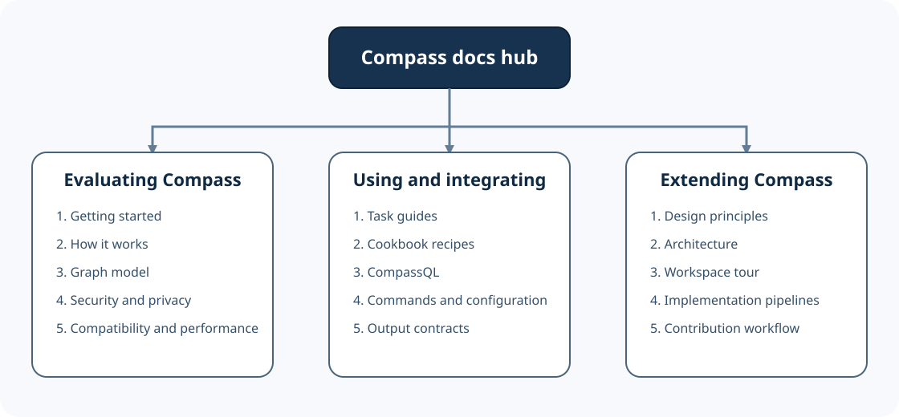

# Compass documentation

Compass is a native, local-first knowledge graph engine for source code and
project artifacts. It discovers the entities in a project, records how they
relate, and gives people and tools a smaller, structured way to explore a large
codebase.

Compass was inspired by
[Graphify](https://github.com/Graphify-Labs/graphify), but the products now
evolve independently. Compass has no Graphify runtime or test dependency. It includes
Compass-native capabilities, such as CompassQL and versioned graph history, and
its public contracts are defined by Compass documentation and native tests.



## Choose your path

### I am evaluating Compass

Start here if you want to understand the product before adopting it:

1. [Getting started](getting-started.md) — install Compass, build a graph, and
   answer a real question.
2. [How Compass works](concepts/how-it-works.md) — understand the pipeline
   without needing graph-database experience.
3. [Graph model](concepts/graph-model.md) — learn what nodes, relationships,
   communities, and provenance mean.
4. [Operations](guides/operations.md) — understand local execution,
   credentials, long-running processes, and recovery.
5. [Compatibility](../COMPATIBILITY.md) and
   [performance](../PERFORMANCE.md) — inspect the published evidence.

### I use or integrate Compass

Start with [Getting started](getting-started.md), then choose the task closest
to yours:

- [Explore an unfamiliar codebase](guides/exploring-a-codebase.md)
- [Integrate Compass with other tools](guides/integrating-compass.md)
- [Set up a coding assistant](guides/assistant-setup.md)
- [Use versioned graph history](guides/versioned-history.md)
- [Review pull requests in GitHub](guides/github-pr-review.md)
- [Operate watch, serve, hooks, and providers](guides/operations.md)
- [Solve a concrete problem](cookbook/README.md)
- [Look up commands and contracts](reference/commands.md)
- [Check framework-route support](reference/framework-routes.md)

## Documentation map

### Learn the concepts

| Document | What it answers |
| --- | --- |
| [How Compass works](concepts/how-it-works.md) | How does a directory become a queryable graph? |
| [Graph model](concepts/graph-model.md) | What do the entities and relationships mean? |
| [Provenance](concepts/provenance.md) | How can I judge where an edge came from? |
| [CompassQL concepts](concepts/compassql.md) | When should I use an exact structural query? |

### Complete a task

| Guide | Outcome |
| --- | --- |
| [Getting started](getting-started.md) | A working local graph and your first useful answers |
| [Exploring a codebase](guides/exploring-a-codebase.md) | A repeatable architecture-reading workflow |
| [Integrating Compass](guides/integrating-compass.md) | Stable, machine-readable data in another tool |
| [Assistant setup](guides/assistant-setup.md) | A native Compass skill installed at the right scope |
| [Versioned history](guides/versioned-history.md) | Immutable graphs and diffs for exact Git commits |
| [GitHub PR review](guides/github-pr-review.md) | Evidence-qualified reports, safe comments, and deterministic gates |
| [Operations](guides/operations.md) | Safe operation of long-running and optional surfaces |

### Copy a recipe

The [cookbook index](cookbook/README.md) routes to:

- [impact analysis](cookbook/impact-analysis.md);
- [architecture discovery](cookbook/architecture-discovery.md);
- [CI and automation](cookbook/ci-and-automation.md);
- [troubleshooting](cookbook/troubleshooting.md).

### Look up an exact contract

| Reference | Contents |
| --- | --- |
| [Commands](reference/commands.md) | Command families, common inputs, output modes, and diagnostics |
| [Configuration](reference/configuration.md) | Providers, environment, paths, and precedence |
| [Outputs](reference/outputs.md) | `compass-out/`, graph JSON, query results, and history exports |
| [Document formats](reference/document-formats.md) | Markdown fields, limits, and discovery versus extraction |
| [Framework routes](reference/framework-routes.md) | Recognized routing shapes, graph projection, and conservative boundaries |
| [PR Intelligence](reference/pr-intelligence.md) | Canonical report, fingerprints, completeness, risk rubric, and gates |
| [Compatibility](reference/compatibility.md) | Compass contracts, hard cutovers, and portability |
| [CompassQL](COMPASSQL.md) | Canonical language and runtime contract |
| [CompassQL support](COMPASSQL_SUPPORT.md) | Checked syntax and feature matrix |

### Work on Compass internals

Implementation documents describe architecture and planned engineering work.
They are not evidence that an uncompleted design has shipped.

| Document | Purpose |
| --- | --- |
| [Universal evidence implementation](implementation/universal-evidence.md) | Current universal evidence pipeline, resolution order, and failure classes |
| [Evidence resolution framework technical design](implementation/evidence-resolution-framework-technical-design.md) | Target ownership, components, interfaces, and invariants for rearchitecting the resolver |
| [Evidence resolution framework execution plan](implementation/evidence-resolution-framework-phased-execution-plan.md) | Phased, commit-oriented implementation and verification plan |
| [Query recall and accuracy design](implementation/query-recall-accuracy/query-performance-accuracy-recall-phased-technical-design.md) | Phased query-quality architecture, evidence, and rollout boundaries |
| [Query implementation plans](plans/README.md) | Ordered, independently executable query-quality work plans |

## How these documents are written

Compass documentation uses four document types:

```text
Concept     explains what something means and why it exists
Guide       walks through a complete task
Cookbook    solves one concrete scenario with a short recipe
Reference   states an exact interface, option, format, or limit
```

This separation is deliberate. A guide should not force you through an
exhaustive option table, and a reference should not hide a precise contract
inside a long tutorial.

Substantial pages open directly with an overview and end with related pages and
a recommended next step. Small diagrams are ASCII so they remain useful in any
terminal. Larger
architecture diagrams are checked-in SVG files with accessible titles and
descriptions.

## Canonical policy and evidence

Some topics already have a single authoritative document. The learning guides
summarize and link to these; they do not replace them:

- [Compatibility ledger](../COMPATIBILITY.md)
- [Migration guide](../MIGRATION.md)
- [Performance qualification](../PERFORMANCE.md)
- [Security policy](../SECURITY.md)
- [Support guide](../SUPPORT.md)
- [Contribution guide](../CONTRIBUTING.md)
- [Code of Conduct](../CODE_OF_CONDUCT.md)
- [CompassQL language contract](COMPASSQL.md)

If a summary and a canonical document ever disagree, follow the canonical
document and open a documentation issue.

## Product status in one paragraph

Compass is a Rust workspace that ships the `compass` executable. Structural
code extraction and graph queries run locally and do not require Python,
embeddings, a vector database, or runtime grammar downloads. Semantic
extraction for documents and other non-code sources is optional and may contact
the provider you explicitly configure. The current release packaging and
platform guarantees are recorded in the
[compatibility ledger](../COMPATIBILITY.md), not inferred from what happens to
compile on one developer machine.

## Related pages

- [Getting started](getting-started.md)
- [How Compass works](concepts/how-it-works.md)
- [Explore a codebase](guides/exploring-a-codebase.md)
- [Command reference](reference/commands.md)

**Next step:** follow [Getting started](getting-started.md) to build and query
your first graph.
