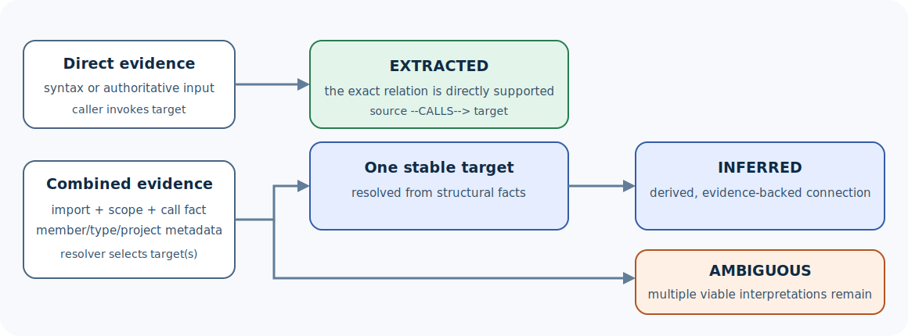

# Provenance and confidence

Compass keeps evidence quality visible. A graph is more useful when you can
distinguish a relation copied from direct syntax from one resolved across files
or left ambiguous.

> **Who this page is for:** users reviewing graph results, integrators ranking
> evidence, and contributors adding relations or resolvers.
>
> **You will learn:** what `EXTRACTED`, `INFERRED`, and `AMBIGUOUS` mean; how
> they are created; and how to use them without turning provenance into a false
> probability.
>
> **Prerequisites:** basic familiarity with [the graph model](graph-model.md).
>
> **Reading time:** 7–9 minutes.



## Provenance answers “how do we know?”

Suppose Compass contains:

```text
CheckoutHandler --CALLS--> authorize_payment()
```

The relation alone says what connects the nodes. Provenance says how Compass
arrived at that connection.

```text
relation type: calls
provenance:    EXTRACTED
evidence:      direct call syntax and target identity in the same scope
```

or:

```text
relation type: calls
provenance:    INFERRED
evidence:      imported name + module target + unique matching definition
```

or:

```text
relation type: calls
provenance:    AMBIGUOUS
evidence:      more than one viable target remained
```

## `EXTRACTED`

`EXTRACTED` indicates direct evidence from an extractor or authoritative input.
Examples can include:

- a function syntactically contained in a file;
- an explicit import declaration;
- an inheritance clause naming a base type;
- a call whose target can be identified directly in the extraction scope;
- an explicit relation in an ingested structured source.

It is the strongest statement about evidence locality, but it is not a runtime
guarantee.

```text
source says:     class Checkout(PaymentFlow)
graph records:   Checkout --INHERITS [EXTRACTED]--> PaymentFlow
```

Static evidence can describe unreachable, test-only, platform-specific, or
dynamically replaced code.

## `INFERRED`

`INFERRED` indicates that Compass derived the connection by resolving multiple
facts. Typical resolution evidence includes:

- import source plus exported symbol;
- call name plus scope and unique definition;
- member name plus receiver type or language-specific call facts;
- re-export chains;
- namespace, package, or project metadata;
- a unique placeholder that can be rewired to a real definition.

```text
file A: import { charge } from "./payments"
file A: charge(total)
file B: export function charge(amount) { ... }

resolver:
  import target + exported name + call fact

result:
  checkout() --CALLS [INFERRED]--> payments.charge()
```

This is structural inference. No semantic model is required for the example.

An inferred edge can be highly reliable when evidence selects one target. The
tag remains valuable because a contributor can inspect the resolution rules and
because future changes may alter available evidence.

## `AMBIGUOUS`

`AMBIGUOUS` indicates unresolved alternatives or low-confidence linkage. It
asks the reader to verify before relying on one interpretation.

Common causes include:

- repeated labels without enough scope information;
- dynamic dispatch;
- reflection or dependency injection;
- incomplete build metadata;
- generated code not present in the corpus;
- multiple modules exporting compatible names;
- semantic extraction that cannot select a unique relation.

```text
process()
  |
  +--possible target--> QueueProcessor.process()
  `--possible target--> BatchProcessor.process()

graph evidence:
  AMBIGUOUS until receiver/type evidence selects one
```

Ambiguity is not a failure to hide. It is useful diagnostic information.

## Provenance is not a numeric probability

Do not assign arbitrary probabilities such as:

```text
EXTRACTED = 100%
INFERRED  = 80%
AMBIGUOUS = 30%
```

Those numbers have no universal meaning across languages, relation types, or
repositories. Provenance is a category describing evidence origin and
resolution status.

If an integration needs ranking, combine:

- provenance;
- relation type;
- source location availability;
- scope or context;
- uniqueness of the matched identity;
- repository-specific knowledge;
- whether independent graph paths support the same conclusion.

Document that ranking as an application policy, not a Compass truth.

## How to review a result

### For code navigation

Use `EXTRACTED` and `INFERRED` relations freely as navigation leads. Verify the
source before making a consequential edit.

### For change impact

Start with both direct and resolved dependency edges. Give ambiguous edges a
manual-review bucket rather than dropping them automatically.

### For architecture documentation

Prefer repeated, cross-file evidence over a single surprising edge. Use source
locations and communities to understand context.

### For automated policy

Use exact CompassQL patterns and explicitly state accepted provenance:

```cypher
MATCH (entry:Function)-[edge:CALLS]->(target:Function)
WHERE target.label = $target
  AND edge.confidence IN ['EXTRACTED', 'INFERRED']
RETURN entry.id, edge.confidence, target.id
```

If a policy must act only on direct evidence:

```cypher
MATCH (source)-[edge]->(target)
WHERE edge.confidence = 'EXTRACTED'
RETURN source.id, type(edge), target.id
```

Remember that attribute presence and naming follow the graph mapping contract.
The CompassQL mapping supplies missing relationship confidence as `EXTRACTED`
for compatibility.

## Provenance and semantic extraction

Semantic sources can add relations that are not program syntax. Their
structured output is validated before merge, but interpretation depends on the
provider, prompt, mode, and source content.

Do not conflate:

```text
structural INFERRED
    derived by deterministic name/scope/project resolution

semantic relation
    derived through the configured semantic pipeline
```

Both can live in one graph. Inspect relation attributes and source metadata,
and keep semantic build profiles distinct in versioned history.

## Provenance through graph operations

Operations that merge, export, diff, or reconstruct graphs should preserve
relationship attributes and multiplicity. Dropping confidence on export makes
later review less trustworthy.

For historical export:

- `graph-json` reconstructs the canonical graph JSON;
- `compass-out` also restores authoritative, non-derivable sidecars and uses
  recorded renderer versions when regenerating derived outputs.

Semantic equivalence does not require insignificant JSON member ordering, but
it does require graph structure, attributes, duplicate id-less hyperedges, and
authoritative bytes to remain correct.

## Troubleshooting unexpected provenance

| Observation | Investigation |
| --- | --- |
| Expected `EXTRACTED`, got `INFERRED` | Check whether target identity required cross-file or member resolution |
| Expected unique target, got `AMBIGUOUS` | Search for duplicate labels, re-exports, missing manifests, or dynamic dispatch |
| Edge disappeared after update | Check whether source, ignore rules, or resolver evidence changed |
| Semantic edge appears in code-only build | Confirm which graph path or historical realization was queried |
| Integration treats missing confidence as unknown | Follow the documented graph/CompassQL compatibility default |

When reporting a suspected extraction bug, include:

- the smallest source fixture that reproduces it;
- the relevant nodes and edge;
- expected relation and provenance;
- actual graph JSON;
- language and project metadata needed for resolution.

## Contributor rule of thumb

When adding an extractor or resolver:

```text
Can one input directly justify the exact endpoints?
    yes -> EXTRACTED may be appropriate
    no  -> resolution evidence is required

Does the evidence select one stable target?
    yes -> INFERRED may be appropriate
    no  -> preserve ambiguity; do not guess
```

Add a fixture that proves direction, multiplicity, attributes, and provenance
together. A test that checks only that “some edge exists” is too weak for a
public graph contract.

## Related pages

- [Graph model](graph-model.md)
- [How Compass works](how-it-works.md)
- [Impact-analysis cookbook](../cookbook/impact-analysis.md)
- [Extending Compass](../implementation/extending-compass.md)

**Next step:** read [CompassQL concepts](compassql.md) to select and filter
evidence precisely.
