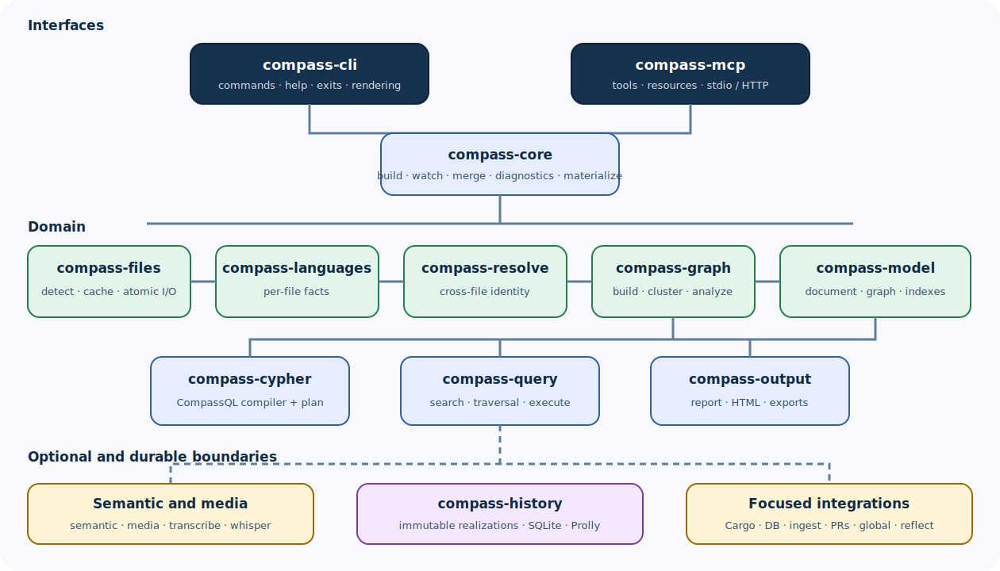

# Compass system architecture

Compass is a Rust workspace organized around a deterministic graph pipeline,
bounded query engines, optional integrations, and immutable history.

> **Who this page is for:** contributors and technical evaluators.
>
> **You will learn:** architectural layers, dependency direction, primary data
> flows, public boundaries, and where to look when behavior changes.
>
> **Prerequisites:** [Design principles](principles.md) and
> [How Compass works](../concepts/how-it-works.md).
>
> **Reading time:** 15 minutes.



## Layered view

```text
Interfaces
  compass-cli · compass-mcp
        |
        v
Application services
  compass-core · history materialization
        |
        +--------------------+
        v                    v
Graph construction       Query
  files/languages          model/query/cypher
  resolve/graph
        |
        v
Optional capabilities
  semantic/media/transcribe/integrations/exporters
        |
        v
Durability and outputs
  atomic artifacts · history store · output renderers
```

The dependency direction aims inward: interfaces coordinate stable domain
services rather than domain crates reaching up into command parsing.

## Interface layer

### `compass-cli`

Owns:

- command dispatch and argument validation;
- help and usage text;
- frontend-specific rendering;
- command-family exit behavior;
- provider/install/hook/history/integration orchestration at the CLI boundary;
- the only shipped `compass` binary.

The binary entry point is intentionally small. It selects specialized runners
for commands such as `diff`, `watch`, and `serve`, then delegates the rest to
the library command dispatcher.

The source contains an internal Graphify-compatibility frontend used by
development parity tests. It is not a second shipped product executable.

### `compass-mcp`

Owns:

- MCP tool and resource definitions;
- graph-backed request handling;
- stdio and HTTP transports;
- authentication and service limits;
- PR and graph query exposure to compatible clients.

It uses core/model/query functionality; it does not reimplement extraction.

## Application-service layer

### `compass-core`

`compass-core` is the orchestration boundary shared by interfaces. Its public
services cover:

- graph build pipelines;
- clustering an existing graph;
- diagnostics;
- graph merging;
- watch mode;
- historical materialization.

`BuildOptions`, `BuildPurpose`, and `SemanticLayer` carry policy into the build
without making lower-level crates parse CLI arguments.

The core returns typed results and timings. The CLI decides how to render them.

## Deterministic construction layer

### `compass-files`

Owns filesystem correctness:

- detection and classification;
- ignore policy and watch filtering;
- source decoding;
- file/stat/prompt fingerprints;
- incremental manifests and caches;
- file slicing;
- atomic JSON/text/byte writes;
- incomplete-build guards.

This layer is used throughout the workspace when a write must be atomic or an
input must be bounded.

### `compass-languages`

Owns statically linked structural extraction:

- language registry;
- built-in and language-specific extractors;
- project/config/manifest extraction;
- SCIP ingestion;
- stable ID helpers;
- per-file `Extraction` facts and raw calls.

The vendored tree-sitter language pack supplies deterministic parser
definitions and queries.

### `compass-resolve`

Owns cross-file resolution over extraction facts:

- import target canonicalization;
- JavaScript/TypeScript re-export handling;
- cross-file calls;
- language member-call facts;
- PHP/C#/C-family canonicalization and disambiguation;
- conservative rewiring of unique stubs;
- collision handling.

It converts per-file facts into a coherent project-wide extraction without
making query or rendering decisions.

### `compass-graph`

Owns graph construction and algorithms:

- merge resolved extractions;
- entity deduplication;
- node-link document construction;
- clustering and community scores;
- stable community remapping;
- god nodes, surprising connections, suggested questions;
- import cycles and graph diffs.

## Model and query layer

### `compass-model`

Owns the typed compatibility model:

- `NodeRecord`;
- `EdgeRecord`;
- `GraphDocument`;
- indexed `Graph`;
- `QueryIndex`;
- schema fingerprints;
- validation and graph loading errors.

It preserves unknown attributes, directed/multigraph semantics, stable string
IDs, and adjacency indexes.

### `compass-query`

Owns:

- text normalization and node scoring;
- focused BFS/DFS traversal;
- shortest-path and explanation rendering;
- affected-impact traversal;
- query benchmarks;
- CompassQL execution, limits, profiling, and plan cache.

The query crate operates over loaded graph snapshots. It does not discover
source files or invoke providers.

### `compass-cypher`

Owns CompassQL language processing:

- lexer and parser;
- AST and values;
- diagnostics and spans;
- semantic/type/scope checks;
- logical plan;
- optimizations;
- support matrix;
- language and planner versions.

Separating compile/planning from execution keeps unsupported syntax rejection
and plan-cache contracts explicit.

## Output layer

### `compass-output`

Owns representations derived from graph data:

- JSON;
- Markdown report;
- interactive HTML;
- SVG;
- GraphML and Cypher;
- tree and call-flow HTML;
- Obsidian and wiki exports;
- canvas-style formats.

Renderers consume graph/analysis data. They should not mutate graph meaning.

## History layer

### `compass-history`

Owns immutable version storage:

- build profiles and extraction fingerprints;
- commit and realization identities;
- canonical encoding and typed keys;
- artifact partitioning and registries;
- SQLite-backed Prolly storage;
- publication and preferred pointers;
- validation;
- diffs;
- Git worktree isolation;
- durable jobs, leases, locks;
- garbage collection.

`compass-core` adapts the regular build pipeline into the `CompleteGraphBuilder`
needed for materialization. `compass-cli` exposes operational commands.

## Semantic and media layer

### `compass-semantic`

Owns untrusted semantic fragment handling and provider orchestration:

- prompts and chunk packing;
- built-in/custom backend selection;
- API request/response normalization;
- adaptive retry and context-limit handling;
- fragment parsing, validation, normalization, and evidence binding;
- community labeling;
- partial-result tracking;
- provider endpoint checks.

### `compass-media`

Extracts bounded text from local files such as PDF, DOCX, and XLSX. Archive
size and compression-ratio guards defend against decompression abuse.

### `compass-transcribe` and `compass-whisper`

`compass-transcribe` owns bounded orchestration, media acquisition contracts,
and backend traits. `compass-whisper` owns bounded native CPU inference
internals. The public CLI does not expose a separate incomplete transcription
product surface.

## Integration crates

| Crate | Responsibility |
| --- | --- |
| `compass-cargo` | Deterministic Cargo workspace dependency introspection |
| `compass-global` | Persistent cross-project graph registry/management |
| `compass-google-workspace` | Bounded Google Workspace shortcut export through `gws` |
| `compass-graphdb` | Native Neo4j Bolt and FalkorDB RESP exporters |
| `compass-ingest` | Bounded, SSRF-resistant URL ingestion |
| `compass-postgres` | Read-only PostgreSQL catalog introspection |
| `compass-prs` | GitHub PR dashboard and graph-impact analysis |
| `compass-reflect` | Deterministic session-memory aggregation and learning overlay |

Each integration converts external data into graph-compatible facts or consumes
graph data through a narrow boundary.

## Verification layer

### `compass-parity`

This development-only crate performs differential verification against the
pinned Python Graphify baseline. It exercises selected data structures,
pipelines, outputs, and integrations.

Parity evidence establishes the certified compatibility ledger. Native
features with no Graphify equivalent require their own tests and qualification.

### Tests and scripts

Evidence is distributed intentionally:

- unit tests beside pure logic;
- crate integration tests for public behavior;
- CLI subprocess tests for commands, streams, exits, and file trees;
- openCypher TCK subsets and differential query tests;
- fuzz targets for untrusted inputs;
- release, performance, and real-repository qualification scripts.

## Primary data flows

### Current-tree build

```text
CLI options
  -> compass-core BuildOptions
  -> compass-files discovery/incremental state
  -> compass-languages per-file extractions
  -> compass-resolve project resolution
  -> compass-graph build/dedup/cluster/analyze
  -> optional semantic merge
  -> compass-output artifacts
  -> compass-files atomic publication
```

### Natural-language graph query

```text
CLI question
  -> compass-model load/index graph
  -> compass-query tokenize/score anchors
  -> bounded traversal
  -> human-focused text
```

### CompassQL

```text
source + parameter types + limits + graph schema fingerprint
  -> compass-cypher compile/plan
  -> compass-query bounded execute
  -> table / versioned JSON / JSONL / profile
```

### Historical query

```text
--at REV
  -> resolve exact commit
  -> open history store
  -> validate preferred realization
  -> lazily materialize if absent
  -> reconstruct graph document
  -> normal query engine
```

## Error ownership

Errors should remain meaningful at their boundary:

| Boundary | Example error |
| --- | --- |
| Files | read, decode, outside-root, atomic write |
| Language | parse/extraction failure |
| Graph | malformed endpoint, invalid document, dedup failure |
| Query | not found, compile diagnostic, resource limit |
| Semantic | provider, response, validation, incomplete fragment |
| History | Git, fingerprint, corruption, publication, lease |
| Integration | network protocol, authentication, unsafe URL |
| CLI | usage, rendering, exit-code mapping |

Avoid converting every error into a generic string too early; structured
context makes both human diagnostics and automated tests stronger.

## Architectural change checklist

When a change crosses layers:

1. identify the crate that owns the new concept;
2. keep CLI parsing out of domain crates;
3. define the data passed across the boundary;
4. define limits and failure behavior;
5. preserve provenance and unknown attributes;
6. decide whether history fingerprints or schemas change;
7. add the narrowest public test plus integration evidence;
8. update compatibility/migration when behavior intentionally diverges.

## Related pages

- [Workspace tour](../implementation/workspace-tour.md)
- [Extraction pipeline](../implementation/extraction-pipeline.md)
- [Storage and history](storage-and-history.md)
- [Extending Compass](../implementation/extending-compass.md)

**Next step:** use the [workspace tour](../implementation/workspace-tour.md) to
locate the exact crate and tests for the subsystem you plan to change.
