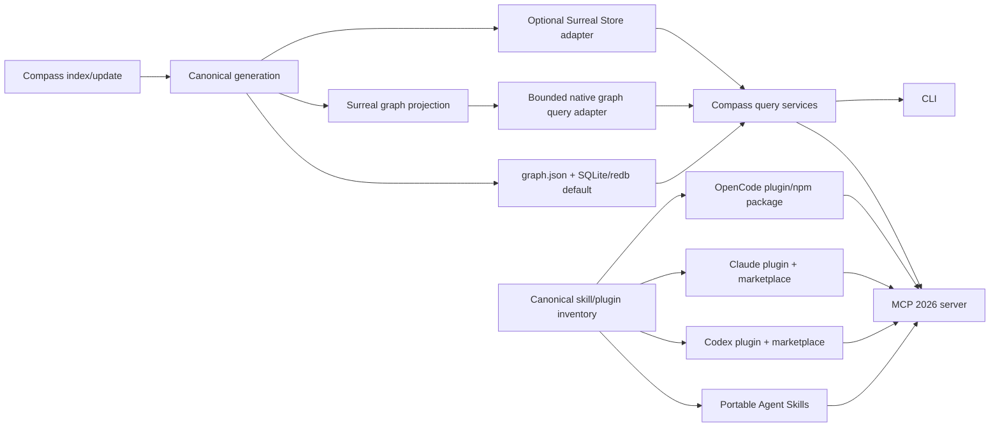

# Compass: SurrealDB, MCP 2026, Agent Skills, and Harness Distribution

> **Status:** research and planning only. This document does not describe shipped
> Compass behavior, an accepted design, or scheduled work. It belongs under
> `docs/future/` so current product documentation remains authoritative.
>
> Read this together with [the earlier SurrealDB evaluation](SURREAL_DB.md) and
> [the upstream contribution plan](upstream-contribution-plan.md).


## Executive conclusion

Compass should pursue this direction, but as four coordinated products rather than
one database replacement:

1. **A graph-native SurrealDB projection/query adapter** that stores immutable,
   generation-keyed Compass nodes and relations and executes bounded native graph
   traversals. This is the part that creates new graph value.
2. **An optional Surreal-backed `Store` adapter**, independently qualified against
   the existing backend contract. This creates persistence portability, not graph
   intelligence by itself.
3. **An MCP 2026 server contract on `rmcp` 3.x** with small, structured,
   task-oriented tools for coding work. The current server is already substantial;
   it needs a protocol migration and product-level response contract, not a rewrite.
4. **One canonical skill/plugin distribution inventory** that generates portable
   Agent Skills plus native Codex and Claude packages and a real OpenCode plugin.

The recommendation is deliberately additive. SQLite/redb and `graph.json` should
remain the default local-first path until SurrealDB clears equivalence, performance,
recovery, binary-size, and licensing gates. Prometheus should remain a separate
system; Compass can copy its generation and installed-artifact validation patterns,
but should not import its control plane, runtime services, or package topology.

The most urgent work is the MCP compatibility migration. Compass pins `rmcp 2.2.0`
in [Cargo.toml](../../Cargo.toml), while the
current `rmcp 3.1.4` release targets MCP 2026-07-28 and supports Compass's Rust
toolchain. MCP 2026 removes protocol sessions and `initialize`, requires
`server/discover`, changes subscriptions, and requires typed result discrimination.
Compass's existing HTTP transport explicitly tests `Mcp-Session-Id` and session
timeouts, so those flags cannot simply be carried forward unchanged. See the
[MCP 2026-07-28 changelog](https://modelcontextprotocol.io/specification/2026-07-28/changelog)
and [rmcp 3.1.4](https://crates.io/crates/rmcp/3.1.4).

## Scope and provenance

The Compass assessment is pinned to commit
`5ca57f2441b90a516eb2a4e78e1fb4e2d2d8269a` (2026-08-09). The checkout was dirty;
in particular, [compass-store/src/lib.rs](../../crates/compass-store/src/lib.rs)
contains uncommitted streaming snapshot-read methods. Those methods are promising for
adapter work but are not treated as released behavior. The installed `compass`
binary was 0.3.6 while the source manifest was 0.3.7. Read-only queries were run
against an existing graph built from the exact commit, containing 119,712 nodes and
281,207 edges.

Prometheus was assessed at commit
`f0df1e0121d176c9467e5c71022737b845af6a20` (2026-08-27). It was used only as local
prior art. Neither checkout was modified.

Current external contracts were retrieved on 2026-08-28 using Firecrawl search and
primary documentation, with Context7 used for current SurrealDB and `rmcp` library
documentation. All source scores, claims, and contradictions are in the companion
research package.

## What Compass already has

This is not a greenfield proposal. Compass already contains most of the necessary
seams.

### Storage and query seams

The `compass-store` crate defines a synchronous backend-neutral contract over
`(namespace, partition, key)` addresses, ordered scans, opaque continuation cursors,
conditional writes, immutable batches, and capability reporting. It includes SQLite,
an in-memory oracle, a redb adapter, and a qualification crate. Its documentation
explicitly anticipates a remote adapter placing a bounded blocking boundary around
network work. That makes a Surreal-backed adapter feasible without changing the
public query API.

The caveat is semantic. `compass-query::open_with_store<S: Store>` can hydrate from
any adapter, but the generic path currently exports/materializes the graph; the
optimized direct record path is SQLite-specific. Therefore, implementing the Store
contract on SurrealDB would validate backend neutrality but would not automatically
make Compass queries graph-native. This is the decisive reason to separate a Store
adapter from a Surreal graph projection/query adapter.

The existing `compass-graphdb` crate is the closest architectural precedent. It is a
bounded native export/push layer for Neo4j Bolt and FalkorDB RESP, rather than the
main query engine. SurrealDB should initially follow the same derived-projection
boundary, with a stronger read adapter added only after equivalence is proven.

### MCP seams

`compass-mcp` already exposes 15 tools:

- typed code navigation: `search_symbols`, `get_callers`, `get_callees`,
  `get_impact`, `explore_code`, `get_node`, and natural-language `query_graph`;
- legacy/general graph queries: `get_neighbors`, `get_community`, `god_nodes`,
  `graph_stats`, and `shortest_path`; and
- pull-request workflows: `list_prs`, `get_pr_impact`, and `triage_prs`.

It also exposes six resources: report, statistics, god nodes, surprises, audit, and
questions. The server supports stdio and Streamable HTTP, bearer tokens, request and
response limits, graph hot reload, and multi-project selection. This is a meaningful
base, not a prototype.

The weaknesses are contract-level:

- most tools are manually declared and several legacy tools return text-only results;
- there are no MCP prompts, explicit output schemas across the full surface, graph
  generation/listen semantics, completion, or task-based long-running operations;
- HTTP behavior is coupled to the pre-2026 session model;
- advanced natural/raw queries are mixed into the same trust surface as safe typed
  navigation; and
- freshness, provenance, confidence, truncation, and continuation are not expressed
  uniformly in every result.

### Skills and harness seams

Compass already embeds an agentskills.io-compatible `compass` skill with 15 reference
documents and an OpenAI agent metadata file. It also has a careful atomic installer
that handles project/user scopes, managed ownership, dry runs, checksums, path and
symlink safety, hooks, and many harnesses—including Codex, Claude Code, and OpenCode.

The gap is native package distribution. The installer places skills and thin
harness adapters, but it does not yet produce current Codex `.codex-plugin` packages
and `.agents/plugins/marketplace.json`, Claude `.claude-plugin` packages and
marketplaces, or a robust OpenCode/npm plugin. It also does not treat MCP configuration
and skill installation as one generated, validated distribution contract.

## Recommended architecture



### 1. Keep a canonical immutable generation

Do not make a live remote database the authoritative index state. Each Compass build
should continue to create a deterministic generation with a stable fingerprint.
Every projected node and edge should carry at least:

- `repository_id`, `generation_id`, and schema version;
- stable Compass node/edge identity;
- kind, language, label/name, and source location;
- direction, multiplicity, confidence, and provenance for relations; and
- optional commit/revision and content fingerprint.

Projection should be transactionally staged and activated by swapping an
`active_generation` pointer only after validation. Readers select one generation for
the duration of a query. This prevents partially refreshed graphs and makes embedded,
remote, and default backends comparable.

### 2. Model true Surreal relations without losing Compass semantics

SurrealDB supports typed relation records created with `RELATE`, plus graph traversal
through inbound and outbound record links. That is useful only if Compass preserves
its own semantics rather than flattening them into generic `RELATED_TO` edges. The
projection should use schemafull node and relation tables and a closed mapping from
Compass edge kinds to relation types. If the number of edge kinds makes one table per
kind operationally unwieldy, use a small number of typed relation families with a
required `kind` field and validated endpoints.

Parallel edges, direction, source anchors, confidence, and inferred-versus-observed
status must survive round-trip qualification. A Surreal query that silently collapses
parallel calls or reverses edge direction is a correctness failure even if it appears
more convenient for agents.

Suggested logical schema:

```text
repository -> generation -> code_node
code_node -[calls/imports/contains/implements/...]-> code_node
relation fields: compass_edge_id, kind, confidence, evidence[], generation_id
code_node fields: compass_node_id, kind, label, language, path, span, generation_id
```

The adapter should generate SurrealQL through typed builders or a closed query plan,
not concatenate arbitrary model-provided graph queries.

### 3. Separate two SurrealDB deliverables

**`compass-graphdb-surreal` (recommended first):** projection, activation, health,
and bounded native reads. It gives users the graph database they asked for and can be
compared directly with `graph.json`/SQLite answers.

**`compass-store-surreal` (optional second):** implements the backend-neutral Store
contract. It is valuable for remote snapshot/history storage and exercises Compass's
adapter design. Because the Store API is synchronous while the SurrealDB SDK is async,
the adapter needs a documented bounded runtime boundary, cancellation and timeout
rules, and no nested-runtime panics. It should pass the existing store qualification
suite unchanged before being considered supported.

Do not merge these crates merely because they share a dependency. They have different
semantic obligations, performance profiles, and failure modes.

### 4. Embedded and remote configurations

For embedded mode, support three testable profiles behind non-default Cargo features:

- `Mem` for deterministic tests and ephemeral sessions;
- SurrealKV as an evaluation target for low-memory/local-first embedded work; and
- RocksDB as the conservative persistent comparison target.

SurrealDB's current deployment guidance labels SurrealKV beta and recommends RocksDB
for conservative server workloads, while suggesting SurrealKV be evaluated first for
embedded behavior. The correct response is a qualification matrix—not a premature
default. See [SurrealDB deployment models](https://surrealdb.com/docs/manage/self-hosted/deployment-models).

For remote mode, use the official Rust SDK transport with TLS, explicit namespace and
database selection, scoped credentials, timeouts, retry budgets, and read-only service
accounts for MCP. Server mode should never be an implicit fallback when an embedded
database fails. Network use and credentials must remain explicit, consistent with
Compass's repository constraints.

### 5. Licensing boundary

The execution-time artifact profile and sign-off gate are maintained in
[`surrealdb-license-decision.md`](surrealdb-license-decision.md). That record
pins the reviewed version and license digest and is authoritative for whether
later SurrealDB waves may proceed.

The `surrealdb` 3.2.4 crate includes core code under BSL 1.1. The official FAQ says
applications may embed, redistribute, modify, and use it in production; the restriction
is offering SurrealDB commercially as a managed DBaaS, and core becomes Apache-2.0
after its change window. The same FAQ is explicit that the core is not OSI-approved
open source during that window. See the [SurrealDB licence FAQ](https://surrealdb.com/license).

Compass is MIT/Apache-2.0. Therefore:

- keep SurrealDB in optional adapter crates/features rather than the default binary;
- include the BSL notice in distributions that bundle core code;
- recognize that optional features contain the default dependency/binary footprint,
  not the obligations of a Surreal-enabled distributed artifact;
- obtain legal/release approval for the exact binary, plugin/archive, package-registry,
  and downstream-redistribution profile;
- document the DBaaS restriction; and
- offer remote-client-only or external-server packaging if a distribution cannot
  accept the embedded core license.

This is a release gate, not legal advice.

## MCP 2026 server design

### Protocol migration

Upgrade to `rmcp 3.1.4` (or a compatible reviewed 3.x pin) in a dedicated change.
Compass's Rust 1.97.1 toolchain exceeds the crate's Rust 1.88 requirement. Do not mix
the dependency migration with SurrealDB work; first establish transport and tool
contract parity.

The migration must cover:

- stateless `server/discover` and removal of default `initialize`/session behavior;
- explicit legacy compatibility only if supporting MCP 2025 clients is a product
  requirement;
- `resultType` and structured output schemas for every result;
- deterministic tool ordering;
- new listen/subscription behavior for generation changes;
- tasks for long-running indexing, refresh, export, and remote projection;
- standard trace/correlation headers and OpenTelemetry propagation;
- OAuth client metadata for hosted deployments if remote multi-user service is added;
- removal or deprecation of `--session-timeout` and other flags that no longer have
  meaning in the 2026 protocol; and
- contract tests against both stdio and stateless HTTP.

### Tool contract

The default server should be read-only. Every tool result should have a common
envelope:

```json
{
  "resultType": "complete",
  "schema": "compass.code_context.v1",
  "repository": "stable-repository-id",
  "generation": "generation-id-or-commit",
  "freshness": {"indexed_at":"...","dirty_worktree":true},
  "data": {},
  "evidence": [{"path":"src/lib.rs","line":42,"kind":"observed"}],
  "confidence": {"value":0.93,"basis":"resolved-call-edges"},
  "truncation": {"truncated":false,"next":null},
  "warnings": []
}
```

Recommended public tools:

| Tool | Primary workflow | Notes |
| --- | --- | --- |
| `code_search` | generation, navigation | Typed symbol/text search; replaces ambiguous naming around `search_symbols`. |
| `symbol_context` | generation, debugging | Definition, callers, callees, owning module, tests, relations, and source anchors in one bounded result. |
| `impact` | refactoring, review | Upstream/downstream blast radius, depth, confidence, affected tests and entry points. |
| `path` | debugging, architecture | Bounded directed path with edge evidence; never silently reverse direction. |
| `subgraph` | architecture | Bounded node/edge projection around explicit seeds, filters, and budget. |
| `diff_impact` | bug fixing, review | Maps working-tree or revision diff to affected symbols, processes, tests, and risk signals. |
| `architecture_map` | architecture | Communities/modules, boundaries, hubs, cycles, and representative source evidence. |
| `source_evidence` | all workflows | Retrieves exact, bounded source spans behind graph claims. |
| `change_plan` | generation/refactoring | Read-only ordered plan derived from impact and source evidence; does not edit files. |
| `query_graph` | expert/fallback | Bounded CompassQL/natural query, read-only, allowlisted operations, strict cost caps. |

Existing PR tools can remain as an optional GitHub capability group. Legacy text tools
should either return the common structured envelope or be marked deprecated. Avoid
publishing raw SurrealQL as a default tool. A power-user query tool can exist behind
an explicit server profile with statement allowlists, row/time/depth limits, and no
write statements.

Mutating operations such as `update`, `watch`, projection sync, or graph-aware rename
belong in a separate opt-in capability profile. When the client and server negotiate
the official `io.modelcontextprotocol/tasks` extension, they should be represented as
tasks with explicit affected paths and confirmation policy, not hidden side effects
of navigation tools. A synchronous bounded fallback is still required for clients
that do not implement the extension.

### Resources, prompts, and change events

Retain the six useful resources, but version their URIs and add generation metadata.
Add resources for capabilities/schema, current generation, and query-cost policy.
Publish task-specific prompts only when they encode stable workflow structure; do not
duplicate the full Agent Skills corpus into prompts.

Emit a generation-changed event/listen update after atomic activation. A client can
then invalidate cached architecture/context results without keeping server session
state.

## Agent Skills and CLI design

### Keep portable skills canonical

Agent Skills are the broad compatibility layer. The current specification requires a
directory with `SKILL.md`; optional scripts, references, and assets load progressively.
The name must be lower-kebab-case and match the directory; description should state
what the skill does and when to use it. The spec recommends concise bodies and
one-level reference links. See the [Agent Skills specification](https://agentskills.io/specification).

Compass's current skill is good operational documentation but broad. Keep it as a
backward-compatible umbrella and generate smaller entry skills:

| Skill | Trigger/workflow | Main MCP/CLI surface |
| --- | --- | --- |
| `compass-navigate` | locate symbols, callers, callees, paths | `code_search`, `symbol_context`, `path` |
| `compass-debug` | diagnose failures and trace likely execution | `symbol_context`, `path`, `source_evidence` |
| `compass-change-impact` | plan refactors, review diffs, find tests | `impact`, `diff_impact`, `change_plan` |
| `compass-architecture` | boundaries, hubs, communities, cycles | `architecture_map`, `subgraph` |
| `compass-index-maintenance` | build, update, watch, validate freshness | MCP tasks and CLI update/doctor |
| `compass-mcp-setup` | configure and diagnose clients/transports | capability discovery and package-specific setup |

Each skill should prefer MCP when the server is available, fall back to the native CLI
using machine-readable output, then verify critical claims in source. Scripts and
references must be physically bundled into every installed artifact; no absolute
developer-machine paths.

### Skill-aware CLI

Do not discard the existing `compass install`. Make skill/package behavior explicit
through a coherent `compass agent` namespace while preserving the current command as
a compatibility alias:

```text
compass agent list
compass agent install --platform codex|claude|opencode|agents --scope project|user
compass agent doctor [--platform ...]
compass agent export --platform ... --out ...
compass agent validate --platform ...
compass agent mcp-config --platform ... --transport stdio|http
```

`doctor` should verify binary version, graph availability/freshness, protocol version,
server discovery, skill checksum, bundled reference parity, plugin manifest validity,
and MCP configuration. `export` should produce deterministic packages without
installing them. `validate` should run platform validators where available and reject
unresolved absolute paths or literal credentials.

## Native harness packages

### Canonical inventory

Create a small Compass-owned manifest—such as `distribution.toml`—that declares:

- product and package version;
- the canonical skill inventory and their bundled files;
- MCP server command/arguments and optional hosted compatibility ID;
- harness-specific hooks or tool bridges;
- install targets, copy policy, and generated output paths; and
- validation commands and artifact checksums.

Generate all packages from this inventory. Commit either the generated artifacts or
reproducible release archives according to Compass's release policy, but always test
the installed artifact—not only the source template.

### Codex

Current official Codex plugin packaging uses `.codex-plugin/plugin.json`, `skills/`,
optional `.mcp.json` for bundled MCP, and optional `.app.json` for a registered remote
MCP compatibility ID. Repository marketplaces live at
`.agents/plugins/marketplace.json`. See [OpenAI plugin documentation](https://developers.openai.com/plugins/build/plugins).

Recommended package:

```text
compass/
  .codex-plugin/plugin.json
  .mcp.json
  skills/compass-*/SKILL.md
  hooks/                 # only if a stable Compass-specific hook is justified
  assets/
.agents/plugins/marketplace.json
```

Use `.mcp.json` for the local stdio server. Add `.app.json` only when Compass operates
a registered hosted server; it is not a generic replacement for local MCP config.

### Claude Code

Claude plugins use `.claude-plugin/plugin.json`, skills, hooks, agents, and `.mcp.json`;
marketplaces are supported and `claude plugin validate` should be part of release
validation. See the [Claude plugin reference](https://code.claude.com/docs/en/plugins-reference)
and [marketplace documentation](https://code.claude.com/docs/en/plugin-marketplaces).

Recommended package:

```text
compass-marketplace/
  .claude-plugin/marketplace.json
  plugins/compass/
    .claude-plugin/plugin.json
    .mcp.json
    skills/compass-*/SKILL.md
    hooks/               # optional freshness or pre-change guard, never required for core use
```

Keep hook behavior advisory and deterministic. The plugin should remain useful in
clients that consume only its skills and MCP configuration.

### OpenCode

OpenCode loads project plugins from `.opencode/plugins/`, global plugins from its
config directory, or npm package names from configuration. Plugins are JavaScript or
TypeScript modules and can define custom tools with `@opencode-ai/plugin` and Zod.
Its current documentation does not define a Codex/Claude-style marketplace manifest.
See [OpenCode plugins](https://opencode.ai/docs/plugins/) and
[custom tools](https://opencode.ai/docs/custom-tools/).

Distribute either:

- `@compass-ai/opencode-plugin` as a versioned npm package; or
- a generated `.opencode/plugins/compass.ts` project plugin.

The plugin should register a thin native bridge or lifecycle hooks and configure the
MCP server; it must not reimplement graph logic in TypeScript. Agent Skills remain the
portable workflow layer.

## Comparable efforts and market signal

| Effort | Relevant shape | Lesson for Compass |
| --- | --- | --- |
| [CodeGraphContext](https://github.com/CodeGraphContext/CodeGraphContext) | Tree-sitter/SCIP indexing, graph database, CLI, MCP, multiple backends | Direct validation of the product category; reliability, packaging, and bounded outputs matter as much as graph construction. |
| [GitNexus](https://github.com/abhigyanpatwari/GitNexus) | Embedded KuzuDB, precomputed communities/processes, seven MCP tools, skills/hooks | Precompute useful intelligence and return task bundles; `impact`, `context`, and `detect_changes` are stronger agent primitives than raw edges. |
| [Serena](https://github.com/oraios/serena) | Language-server-backed symbol retrieval/editing/refactoring over MCP | Agents value precise semantic navigation and focused source edits; Compass should interoperate with, not pretend to replace, LSP precision. |
| [Sourcegraph MCP](https://sourcegraph.com/mcp) | Cross-repository search, navigation, history, deep search | Remote/multi-repository value is a distinct tier; keep local-first use excellent before broadening scope. |
| [repo-graph](https://github.com/James-Chahwan/repo-graph) | Small stdio MCP for codebase navigation | Installation simplicity is a competitive feature; one command and self-contained local operation matter. |
| [CodeQL Development MCP](https://github.com/advanced-security/codeql-development-mcp-server) | Agent access to deep static/security analysis | Specialized analysis should be an optional capability group, with strict execution and data boundaries. |

Compass's credible differentiation is not “another code graph MCP.” It is the
combination of deterministic native indexing, explicit observed/inferred evidence,
bounded typed queries, historical/revision graphs, local-first operation without
credentials, store qualification, and the same contract exposed through CLI, MCP,
and portable skills.

## Lessons to borrow from Prometheus—without integration

Prometheus's `skill-system.json` demonstrates the right distribution principle: one
canonical inventory maps skills, imports, profiles, targets, and generated outputs.
Its generated Codex/Claude packages and actual OpenCode TypeScript plugin show why
platform-specific artifacts should be derived rather than hand-maintained.

Compass should borrow these practices:

- one canonical inventory with deterministic generation;
- copy real skill directories rather than relying on symlinks;
- bundle all scripts/references/assets;
- validate installed artifact parity and path portability;
- keep credentials and host-specific paths out of MCP templates;
- version-bump and rebuild immutable plugin caches; and
- test harness-native validators in release CI.

Compass should not import Prometheus's runtime services, memory/control plane,
orchestrator, plugin cache, or repository structure. No Compass package should require
Prometheus to install or run. Compatibility should occur through public standards:
Agent Skills, MCP, CLI contracts, and normal plugin packaging.

## Delivery roadmap and gates

### Phase -1 — cheap disqualifiers (before adapter implementation)

- Obtain written legal/release acceptance for the exact SurrealDB 3.2.4 artifact
  profile: BSL 1.1 core, Additional Use Grant excluding commercial Database Service,
  2030-01-01 change date, Apache-2.0 change license, notices, package registries,
  plugins, and downstream redistribution.
- Build throwaway persistent SurrealKV and RocksDB spikes that prove parallel directed
  relations, stable IDs, provenance, generation-scoped reads, and kill-during-write
  recovery. Delete the spikes; retain test vectors and result records.
- Review and name `rmcp 3.1.4` as the migration candidate rather than promising an
  unspecified 3.x release.

**Exit gate:** the full distributed-artifact profile is accepted, persistent
edge/recovery probes pass, and the
`rmcp 3.1.4` API/dependency review finds no blocking incompatibility. Otherwise retain
the existing SQLite/redb/`graph.json` and `rmcp 2.2.0` paths while reconsidering
alternatives.

### Numeric qualification budgets

Use deterministic `qualification-medium` (100,000 nodes/250,000 edges) and
`qualification-large` (1,000,000 nodes/2,500,000 edges) fixtures plus the checked-in
semantic corpus. These thresholds are initial product gates and should be changed only
by a recorded decision before measurements are run:

| Gate | Threshold |
| --- | --- |
| Semantic equivalence | 100% preservation of identity, direction, parallel edges, confidence, source evidence, bounds, and pagination on the semantic corpus plus deterministic samples from both scale fixtures. |
| Default footprint | No linked Surreal dependencies and zero Surreal-attributable size delta when the feature is disabled. |
| Enabled footprint | Compressed artifact and peak RSS each no more than 2.0x current baseline on `qualification-medium`. |
| Core query regression | Search/callers/callees p95 no more than 1.10x current engine. |
| Native graph value | At least 10% lower p95 on depth-3+ impact/path and at least 15% fewer query calls or response tokens, with no evidence-recall or task-success loss. |
| Recovery | No partial generation visible; last active medium generation queryable within 30 seconds after killed writer. |
| Agent tool value | On 30 versioned tasks, evidence recall and success are no worse than bounded raw traversal, and tool calls improve ≥20% or output tokens ≥15%. |
| Skill compatibility | Zero regressions on recorded umbrella invocations and zero incorrect/ambiguous selections on a new focused-skill boundary-prompt suite. |

These are conservative containment and minimum product-significance thresholds, not
observed performance claims. Ratify them before benchmark results are visible. Phase 0
must create and version the semantic corpus, scale-fixture generators, benchmark
harness, bounded raw-traversal baseline, 30-task suite, umbrella invocation corpus,
focused-skill boundary prompts, MCP conformance record, and harness interop matrix.

### Proposed Compass change map

The exact crate names can change during design review, but ownership should remain
clear:

| Area | Proposed change | Must not absorb |
| --- | --- | --- |
| workspace `Cargo.toml` | Pin reviewed `rmcp` 3.x; add optional Surreal adapter members and feature policy | Do not put SurrealDB in default workspace dependencies used by every binary. |
| `compass-store` | Keep the public contract stable; land/review streaming reads independently | No Surreal SDK imports in the core contract crate. |
| new `compass-store-surreal` | Store adapter, runtime boundary, capability mapping, qualification harness | No graph-specific `RELATE` query API. |
| new `compass-graphdb-surreal` | Schema, projection, activation, bounded graph reads, health/migration | No MCP or CLI presentation logic. |
| `compass-query` | Add a Surreal `GraphEngine`/typed planner route and dual-engine equivalence fixtures | No raw model-authored SurrealQL execution. |
| `compass-mcp` | MCP 2026 discovery/transports, common result schema, tasks/listen negotiation, tool profiles | No database-specific response types. |
| `compass-cli` | `agent` commands, Surreal configuration commands, projection/status/doctor surfaces | No hand-maintained copies of harness packages. |
| `crates/compass-cli/assets` or new distribution crate | Canonical skills and generated plugin templates/inventory | No Prometheus runtime or repository dependency. |
| CI/release | Store and graph equivalence, protocol conformance, package generation, native validators, clean-install tests | No validation that runs only against source templates. |

Configuration should use typed, versioned sections with secrets referenced through
environment/secret providers rather than stored inline. A representative shape is:

```toml
[graph.surreal]
enabled = true
mode = "embedded"              # embedded | remote
engine = "surrealkv"           # mem | surrealkv | rocksdb
path = "compass-out/surreal"
namespace = "compass"
database = "code_graph"

[graph.surreal.remote]
endpoint = "wss://graph.example.invalid"
credential_env = "COMPASS_SURREAL_TOKEN"
connect_timeout_ms = 5000
query_timeout_ms = 10000
```

The final names should follow the SDK's supported endpoint/engine matrix. `doctor`
must reject a remote-only field in embedded mode and must never echo credential values.

### Phase 0 — contract baselines (1–2 weeks)

- Freeze golden answers for current typed queries, MCP tool schemas/results, graph
  direction/multiplicity, and transport behavior.
- Record binary size, cold start, query latency, peak memory, and 100k/1m-node
  behavior on current SQLite/JSON paths.
- Create and version every measurement artifact named by the qualification budgets,
  including the raw-traversal and skill-routing baselines.
- Document which dirty streaming-store work will be committed or excluded.

**Exit gate:** reproducible local baselines and no dependency on uncommitted methods.

### Phase 1 — MCP 2026 migration (2–4 weeks)

- On a branch, review `rmcp 3.1.4` for API breakage, MSRV/Rust 1.97.1, license,
  transitive dependencies, unsafe-code exposure, protocol versions, and transports;
  obtain MCP/storage owner sign-off.
- Run reference conformance and the named harness interop matrix before merge.
- Upgrade specifically to reviewed `rmcp 3.1.4` only after those branch gates pass.
- Implement stateless discovery, typed results, deterministic tool ordering, and
  transport contract tests.
- Deprecate session flags; optionally preserve a named legacy protocol mode.
- Introduce the common result envelope without renaming all tools at once.

**Exit gate:** stdio and HTTP reference conformance plus an interop matrix for Codex
CLI 0.146.0, Claude Code 2.1.250, and OpenCode 1.18.23 (or explicitly recorded newer
versions). If retained, the legacy profile expires after at most 90 days or two
Compass minor releases, whichever comes first, unless a recorded client blocker is
approved; it carries duplicate transport/result tests and a compatibility translator.

### Phase 2 — Surreal graph projection adapter (3–5 weeks)

- Add the optional projection crate after the persistent throwaway probes pass; keep
  Mem only as a deterministic test engine.
- Define schemafull nodes/relations and generation activation.
- Implement `symbol_context`, `impact`, `path`, and `subgraph` through both current and
  Surreal engines.
- Run property-based and corpus-based equivalence tests for direction, parallel edges,
  confidence, evidence, bounds, and pagination.

**Exit gate:** zero semantic mismatches on the qualification corpus and deterministic
scale samples. A mismatch in identity, direction, multiplicity, provenance, bounds,
or ordering is a failure, not a documented compatibility exception.

### Phase 3 — embedded qualification (3–6 weeks)

- Benchmark SurrealKV and RocksDB builds separately.
- Test crash recovery, interrupted activation, corruption handling, backup/restore,
  migrations, disk growth, cold start, incremental projection, and binary size.
- Complete license/release review.

**Exit gate:** an explicit supported engine matrix. No default switch merely because
the spike works.

### Phase 4 — remote server mode (3–6 weeks)

- Add scoped authentication, TLS, secret redaction, timeouts, retries, health checks,
  and read consistency pinned to one generation.
- Add tasks for projection/update and listen notifications for activation.
- Test disconnects, duplicate requests, retry safety, stale credentials, server
  upgrades, and partial network partitions.

**Exit gate:** failure-injection tests and a documented operations/runbook contract.

### Phase 5 — skills and native packages (2–4 weeks)

- Split task skills while preserving umbrella compatibility.
- Add `compass agent list/install/doctor/export/validate/mcp-config`.
- Generate Codex and Claude packages/marketplaces and an OpenCode plugin/npm artifact.
- Test clean-machine installation and uninstall/upgrade ownership behavior.

**Exit gate:** every generated artifact passes native validators and clean
install/discovery/load/MCP invocation/upgrade/uninstall on the named harness version,
contains no absolute developer paths or credentials, and invokes the same MCP contract.

## Required test matrix

| Dimension | Required cases |
| --- | --- |
| Semantics | node/edge identity, direction, parallel edges, self-loops, confidence, source anchors, history selector |
| Bounds | max depth, rows, bytes, tokens, time, continuation, cancellation |
| Storage | point reads, ordered scans, cursors, conditional writes, immutable batches, capability errors |
| Projection | idempotence, atomic activation, interrupted write, rollback, schema migration, duplicate generation |
| Embedded | Mem, SurrealKV, RocksDB; clean and dirty shutdown; large graph; disk pressure |
| Remote | TLS/auth, latency, timeout, retry, disconnect, server restart, version skew, read-only role |
| MCP | discovery, tools/resources/prompts, structured result schemas, tasks, listen, stdio/HTTP, legacy matrix |
| Security | path scope, query allowlist, injection, secret redaction, request/response caps, denial-of-service budgets |
| Distribution | reproducible package, checksum, copy parity, no symlinks where unsupported, native validator, upgrade/uninstall |

## Risks and mitigations

| Risk | Severity | Mitigation |
| --- | --- | --- |
| SurrealDB dependency significantly increases build time/binary size | High | Optional crates/features; measure before release; remote-client-only package option. |
| BSL conflicts with a distribution or customer policy | High | Release/legal gate, bundled notices, optional isolation, external-server client path. |
| Two persistence models drift semantically | High | One canonical generation, dual-engine golden/property tests, fingerprinted activation. |
| MCP 2026 breaks current clients | High | Published compatibility matrix, explicit legacy mode, contract tests, staged deprecation. |
| Raw graph query enables expensive or unsafe requests | High | Read-only typed tools by default, closed planners, cost estimates, hard budgets. |
| Remote graph becomes stale relative to source | High | Generation IDs in every result, atomic activation, listen notifications, freshness warnings. |
| Skills and plugins drift | Medium | One inventory, deterministic generation, installed-artifact validation. |
| Tool proliferation confuses agents | Medium | Task-oriented core set, stable descriptions, deterministic ordering, capability profiles. |
| Prometheus coupling expands scope | Medium | Standards-only compatibility and separate release pipelines. |

## Falsifiers and decision checkpoints

The recommendation should be revised or stopped if any of these occur:

1. The full distributed-artifact BSL review or either persistent edge/recovery spike fails.
2. Surreal projection cannot preserve Compass edge direction, multiplicity, source
   evidence, and bounded query semantics without product-breaking exceptions.
3. Any numeric footprint, recovery, equivalence, query-regression, or native-value
   budget above fails.
4. Remote Store qualification requires weakening ordered scans, cursor stability,
   conditional writes, or error taxonomy.
5. The 30-task MCP suite fails its evidence recall, success, call-count, and token
   thresholds; in that case redesign or drop the task-level additions.
6. The umbrella invocation or boundary-prompt corpus regresses; in that case keep only
   the existing umbrella entry point while revising focused skills.
7. MCP reference conformance or the named client/version matrix fails on the migration
   branch; do not merge the upgrade.
8. Generated packages fail clean install/discovery/load/MCP invocation/upgrade/uninstall,
   or require secrets, machine-specific paths, or Prometheus runtime dependencies.

Decision checkpoints should be evidence-based: approve graph projection after Phase
2 equivalence, approve an embedded engine only after Phase 3 qualification, approve
remote support after failure injection, and approve marketplaces after clean-machine
artifact tests.

The explicit fallback for Surreal failure is the existing SQLite/redb/`graph.json`
stack. Existing Neo4j/Falkor exporters remain a remote alternative. A Store-only
Surreal implementation was rejected as the first milestone because it cannot prove
graph-native value. The umbrella skill remains the fallback if additive focused skills
do not pass compatibility tests.

## Adversarial-review result

The isolated cross-model decision review ran twice and ended `BLOCK` with 2 critical,
6 warning, and 1 suggestion findings. Its first round correctly rejected undefined
budgets and post-build licensing/edge checks; it also received unrelated workspace
constraints, so round two was rebuilt from the Compass repository and included the
actual local-first constraints.

Round two found that a Mem-only spike could not test persistent recovery and that
feature gating had been incorrectly described as containing the BSL footprint. This
final revision moves the pre-build probes to persistent SurrealKV and RocksDB with a
kill test, defines the exact distributed-artifact license profile, adds creation of all
measurement corpora, makes MCP interop a pre-merge condition, extends equivalence to
scale samples, strengthens agent/skill gates, and requires clean package load tests.

The review skill's two-round cap prevents another independent verdict in this run.
Accordingly, these changes are **addressed but not re-vetted**, and the report remains
`partial` rather than claiming an adversarial PASS. The residual unknowns are the
formal license decision, empirical reasonableness of the proposed numeric budgets,
and future harness interoperability. Raw findings and both review packets are retained in the original external research
package; they are intentionally not copied into this repository.

## Final recommendation

Proceed with a staged program, starting with distributed-artifact license review,
persistent edge/recovery probes, and an MCP 2026 migration branch. Do **not** begin by
replacing SQLite or implementing
only `Store` over SurrealDB; that would assume the most risk while delivering the
least graph-native value.

The target product is a deterministic Compass generation that can be queried through
the current local engine or a qualified Surreal projection, exposed through one
bounded MCP contract and taught through portable skills. Native harness plugins should
package that same contract, not fork it. If qualification succeeds, users gain a true
embedded or remote graph database without sacrificing Compass's local-first baseline.
If it fails, the MCP, skill, and packaging improvements still stand on their own.

## Source index

The original external research package contains the 36-source registry, claim graph,
citations, contradiction log, and review artifacts. This repository copy preserves the
synthesis only. Highest-value external sources are:

- [MCP 2026-07-28 changelog](https://modelcontextprotocol.io/specification/2026-07-28/changelog)
- [rmcp 3.1.4](https://docs.rs/rmcp/3.1.4/rmcp/)
- [SurrealDB deployment models](https://surrealdb.com/docs/manage/self-hosted/deployment-models)
- [SurrealDB licence FAQ](https://surrealdb.com/license)
- [Agent Skills specification](https://agentskills.io/specification)
- [OpenAI Codex plugin packaging](https://developers.openai.com/plugins/build/plugins)
- [Claude Code plugin reference](https://code.claude.com/docs/en/plugins-reference)
- [OpenCode plugins](https://opencode.ai/docs/plugins/)
- [CodeGraphContext](https://github.com/CodeGraphContext/CodeGraphContext)
- [GitNexus](https://github.com/abhigyanpatwari/GitNexus)
- [Serena](https://github.com/oraios/serena)
