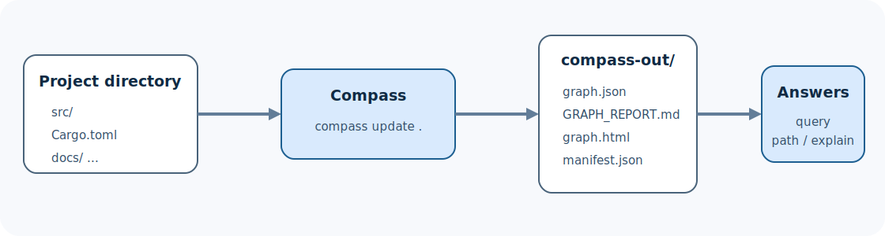

# Getting started with Compass

This guide takes you from a new installation to a useful answer about a
codebase. It starts with structural code analysis, which runs locally and does
not require model credentials.

> **Who this guide is for:** new users and evaluators.
>
> **You will learn:** how to install Compass, build a graph, understand its
> output, ask four kinds of questions, and recognize a successful run.
>
> **Prerequisites:** a macOS release target or a Rust 1.97.1+ toolchain for a
> source build; a source-code repository to inspect.
>
> **Completion time:** 10–15 minutes, plus compilation time for a source build.



## What you will produce

At the end of this guide, a project directory will contain:

```text
your-project/
├── src/
├── ...
└── compass-out/
    ├── graph.json
    ├── GRAPH_REPORT.md
    ├── graph.html        when the graph is within the visualization limit
    └── manifest.json
```

You will also be able to run:

```bash
compass query "where is authentication enforced?"
compass explain AuthenticationService
compass path LoginHandler AuthenticationService
compass affected AuthenticationService --depth 3
```

The exact symbols in your repository will differ. The important outcome is
that Compass can find and traverse relationships without rereading every source
file for each question.

## 1. Choose an installation path

### Install a macOS release

The current release workflow publishes Intel and Apple Silicon macOS archives.
The installer downloads the latest archive, verifies its SHA-256 checksum, and
installs `compass` into `~/.local/bin` by default:

```bash
curl --proto '=https' --tlsv1.2 -LsSf \
  https://github.com/crabbuild/compass/releases/latest/download/install.sh |
  sh
```

Choose another directory by setting `COMPASS_INSTALL_DIR` for the installer
process:

```bash
COMPASS_INSTALL_DIR="$PWD/bin" sh install.sh
```

The current macOS release is unsigned and not notarized. Read the release notes
and [security policy](../SECURITY.md) before using an installer in a controlled
environment.

### Build from source

The repository pins Rust 1.97.1 in `rust-toolchain.toml`:

```bash
git clone https://github.com/crabbuild/compass.git
cd compass
cargo install --locked --path crates/compass-cli --bin compass
```

`--locked` uses the dependency versions in `Cargo.lock`. The resulting
executable is native: normal use does not launch Python. Python is used only by
selected development parity tests.

### Verify the binary

Run:

```bash
compass --version
compass --help
```

A successful installation prints a version and the public command surface. If
your shell reports `compass: command not found`, first check:

```bash
command -v compass
printf '%s\n' "$PATH"
```

For the default installer location, make sure `~/.local/bin` is on `PATH`, then
open a new shell.

## 2. Choose a repository

You can use an existing checkout. For a low-risk first run, use a small sample
repository or create one:

```bash
mkdir compass-first-project
cd compass-first-project
git init
mkdir src
```

Create `src/app.py` with a small call chain:

```python
class PaymentGateway:
    def charge(self, amount):
        return {"approved": True, "amount": amount}


def authorize_payment(gateway, amount):
    return gateway.charge(amount)


def checkout(total):
    gateway = PaymentGateway()
    return authorize_payment(gateway, total)
```

Compass does not require a Git repository for a normal current-tree build, but
Git is required for exact-revision history features.

## 3. Build the graph

From the project root, run:

```bash
compass update .
```

`update` is the normal “make the saved graph match this working tree” command.
On the first run, Compass performs a cold build. On later runs it can use the
manifest and extraction cache to avoid repeating unchanged work.

For source code, Compass:

```text
discovers files
      |
      v
detects languages and project metadata
      |
      v
parses syntax and extracts entities/relations
      |
      v
resolves cross-file references
      |
      v
analyzes and publishes compass-out/
```

Structural extraction does not call a model. If a project includes documents,
images, or other semantic sources, use `--code-only` when you explicitly want
to skip them:

```bash
compass extract . --code-only
```

`extract` exposes detailed build controls. For most first-time codebase use,
`update` is the simpler entry point.

## 4. Confirm that the build succeeded

Check the expected files:

```bash
test -f compass-out/graph.json
test -f compass-out/GRAPH_REPORT.md
test -f compass-out/manifest.json
```

Then read the report:

```bash
sed -n '1,160p' compass-out/GRAPH_REPORT.md
```

The report is the fastest repository-wide orientation. It summarizes graph
size and points out highly connected nodes, communities, and diagnostics. A
large degree does not automatically mean “most important”: generic utilities
and broad containers may also become highly connected.

If `graph.html` exists, open it with your platform's normal browser command:

```bash
open compass-out/graph.html       # macOS
xdg-open compass-out/graph.html  # many Linux desktops
```

The HTML view is for exploration. `graph.json` remains the machine-readable
source for query commands and integrations.

## 5. Ask the first four questions

Compass provides several question shapes because no single ranking works for
every investigation.

### Find a relevant neighborhood

```bash
compass query "payment authorization"
```

Natural-language query is local graph discovery, not a model-generated answer.
Compass scores likely anchors and traverses the saved graph to return a focused
subgraph.

Use a sentence that names the behavior you care about:

```bash
compass query "where are failed payments retried?"
compass query "configuration loading and validation"
compass query "HTTP request authentication"
```

### Explain one entity

```bash
compass explain authorize_payment
```

`explain` shows the matching node and its incoming and outgoing relationships.
Use it after a broad query gives you a symbol worth inspecting.

### Trace a path

```bash
compass path checkout PaymentGateway
```

`path` finds a known route between two graph entities. A path explains
connectivity in the extracted graph; it is not necessarily the only runtime
path or proof that every edge executes in one transaction.

### Estimate change impact

```bash
compass affected authorize_payment --depth 3
```

`affected` follows impact-relevant relationships to produce a review scope.
Treat its output as evidence for investigation, not a guarantee that every
returned file must change or that every possible dynamic dependency was found.

## 6. Read provenance instead of treating every edge equally

A result may include relationships marked with provenance such as
`EXTRACTED`, `INFERRED`, or `AMBIGUOUS`:

```text
checkout
   |
   +--CALLS [EXTRACTED]--> authorize_payment
                                  |
                                  `--USES [INFERRED]--> PaymentGateway
```

- **EXTRACTED** means direct source or parser evidence created the relation.
- **INFERRED** means Compass resolved evidence across scopes or files.
- **AMBIGUOUS** means more than one interpretation remained.

Inference here is structural resolution; it does not imply an LLM invented the
edge. See [Provenance and confidence](concepts/provenance.md) for the full
model.

## 7. Run an exact query when discovery is not enough

CompassQL is a deterministic, read-only subset of openCypher:

```bash
compass query --cql \
  "MATCH (caller)-[:CALLS]->(target)
   WHERE target.label = 'authorize_payment'
   RETURN caller.id, target.id
   LIMIT 20"
```

Use CompassQL when you need an exact graph pattern, parameters, stable
automation, or JSON/JSONL output. Compass never guesses whether input is
CompassQL; `--cql` is explicit.

Before building automation, read:

- [CompassQL concepts](concepts/compassql.md)
- [CompassQL 1 reference](COMPASSQL.md)
- [CompassQL support matrix](COMPASSQL_SUPPORT.md)

## 8. Install the coding-assistant integration

Compass embeds its assistant skill assets in the binary:

```bash
compass install
```

Choose a specific platform or project scope when needed:

```bash
compass install --platform codex
compass install --project --platform codex
```

A global installation is convenient for personal use. A project-scoped
installation can be reviewed and shared with a repository. Inspect generated
files before committing them, especially in a repository with existing agent
instructions.

See [Assistant setup](guides/assistant-setup.md) for platform selection,
verification, upgrades, and removal.

## 9. Update after a code change

Edit a source file, then run:

```bash
compass update .
```

An incremental update should preserve unchanged extraction work and republish a
coherent artifact set. Do not edit `graph.json` or `manifest.json` by hand and
expect an update to preserve those edits.

For continuous local changes, `compass watch` can keep the output current. Read
[Operations](guides/operations.md) before using a long-running process in CI or
an editor integration.

## Common first-run problems

| Symptom | Likely cause | What to do |
| --- | --- | --- |
| `compass` is not found | Install directory is not on `PATH` | Add the directory, open a new shell, rerun `command -v compass` |
| Rust build selects another toolchain | Local override or old rustup state | Run `rustup show`, then use the pinned toolchain from `rust-toolchain.toml` |
| Expected files are missing | Command failed or wrote to another output directory | Read stderr, check the exit status, and look for `--out` in the command |
| Non-code files ask for provider configuration | Semantic sources are present | Configure a provider intentionally or use a code-only build |
| A symbol is not found | It was ignored, unsupported, generated, or labeled differently | Inspect `GRAPH_REPORT.md`, query by file/module, and read [Troubleshooting](cookbook/troubleshooting.md) |
| `graph.html` is absent | Visualization was disabled or the graph exceeds its rendering limit | Query `graph.json` through the CLI; HTML is not required |
| Results feel too broad | Query text names a generic concept or hub | Add domain terms, explain a specific result, or use CompassQL |

## What Compass does not promise

- A static graph is not a complete runtime trace.
- Dynamic dispatch, generated code, reflection, and unavailable build metadata
  can limit what structural analysis resolves.
- An inferred edge is evidence-backed but less direct than an extracted edge.
- A current-tree graph does not represent an old commit; use
  [versioned history](guides/versioned-history.md) for exact revisions.
- A successful local build does not expand the officially supported release
  platform matrix. Follow [Compatibility](../COMPATIBILITY.md).

## Clean up

The current-tree build is stored under `compass-out/`. Remove that directory
only when you intend to discard the generated graph and incremental manifest.
It can be regenerated with `compass update .`.

Versioned history is different: it is stored under the repository's Git common
directory and may be shared by linked worktrees. Do not delete its SQLite,
WAL, or operational files while Compass is running. Use history commands
described in [Versioned graph history](guides/versioned-history.md).

## Related pages

- [Documentation hub](README.md)
- [How Compass works](concepts/how-it-works.md)
- [Explore an unfamiliar codebase](guides/exploring-a-codebase.md)
- [Troubleshooting cookbook](cookbook/troubleshooting.md)

**Next step:** use [Explore an unfamiliar codebase](guides/exploring-a-codebase.md)
to turn your first graph into a repeatable investigation.
