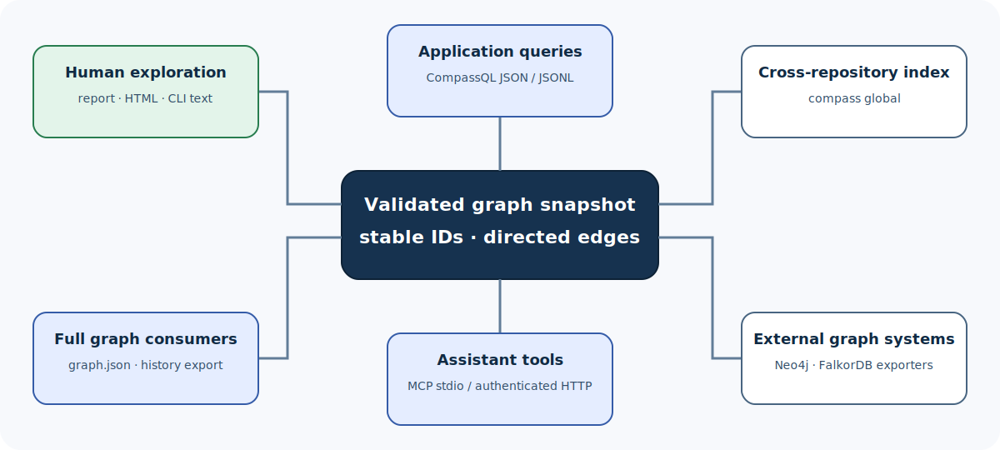

# Integrate Compass with other tools

Compass can be used interactively, as a producer of versioned JSON, through an
MCP service, or as an exporter to graph systems. This guide focuses on stable
boundaries and failure-safe consumption.

> **Who this guide is for:** developers building scripts, CI jobs, editor
> features, internal portals, and graph-analysis integrations.
>
> **You will learn:** how to choose an integration surface, consume outputs
> safely, use CompassQL parameters and versioned results, and avoid coupling to
> unstable human text.
>
> **Prerequisites:** a working graph and familiarity with
> [CompassQL concepts](../concepts/compassql.md).
>
> **Completion time:** 20 minutes for the pattern; implementation time depends
> on the consumer.



## Choose the narrowest stable surface

| Integration need | Recommended surface |
| --- | --- |
| Human exploration | CLI text, report, HTML |
| Scripted exact graph pattern | CompassQL JSON or JSONL |
| Full graph processing | `compass-out/graph.json` |
| Historical reproducibility | History `graph-json` or `compass-out` export |
| Coding-assistant tool calls | `compass serve` / MCP |
| Cross-repository graph lookup | `compass global` |
| External graph database | `compass export` and configured target |
| Compare revisions | `compass diff --format json` |

Human text is optimized for clarity and can evolve. Machine consumers should
prefer explicitly versioned JSON or documented graph schemas.

## Integration pattern: produce, validate, publish, consume

Treat a graph build as a producer job:

```text
source checkout
    |
    v
compass update/extract
    |
    +-- failure --> keep prior published consumer state
    |
    `-- success --> validate expected artifacts
                         |
                         v
                  hand snapshot to consumer
```

Run the producer to completion before a consumer opens the result:

```bash
compass update .
test -s compass-out/graph.json
```

Do not infer success from a partially written log or the mere existence of an
old `graph.json`. Check the command exit status.

## Use CompassQL for application-shaped data

A focused query reduces transfer and decouples the consumer from unrelated
graph attributes:

```bash
compass query --cql \
  'MATCH (caller)-[edge:CALLS]->(target)
   WHERE target.label = $target
   RETURN caller.id, edge.confidence, target.id
   ORDER BY caller.id' \
  --param target=authorize \
  --format json \
  --output target/authorize-callers.json
```

The JSON result uses `compass.cql.result/1`. Validate the major version before
reading columns or typed values.

### Prefer parameters

Do not build query text by concatenating a label:

```text
unsafe and fragile:
  "WHERE n.label = '" + user_value + "'"
```

Pass it as data:

```bash
compass query --cql --file queries/find-label.cypher \
  --param target="$TARGET_LABEL" \
  --format json
```

This protects query structure and preserves parameter typing.

### JSON versus JSONL

Use JSON when:

- results are modest;
- one complete document is convenient;
- plan/profile metadata belongs beside rows.

Use JSONL when:

- a streaming pipeline consumes rows one at a time;
- line-oriented tools are convenient;
- you still validate the `compass.cql.jsonl/1` header and final summary.

An execution error does not represent a valid truncated result.

## Use explicit limits

An integration should set budgets that match its job:

```bash
compass query --cql --file queries/dependencies.cypher \
  --format json \
  --timeout-ms 3000 \
  --max-rows 5000 \
  --max-path-depth 8 \
  --max-expanded-relationships 1000000 \
  --max-memory-bytes 134217728
```

On a limit error:

- do not interpret it as zero matches;
- narrow labels, relation types, or path bounds;
- partition the query by subsystem or file type;
- decide deliberately whether a larger resource budget is safe.

## Consume the full graph

`compass-out/graph.json` uses NetworkX-style node-link data:

```json
{
  "directed": true,
  "multigraph": true,
  "graph": {},
  "nodes": [
    {"id": "opaque-id", "label": "display name"}
  ],
  "links": [
    {
      "source": "opaque-id",
      "target": "other-id",
      "relation": "calls",
      "confidence": "EXTRACTED"
    }
  ]
}
```

Consumer rules:

1. treat node IDs as opaque strings;
2. preserve unknown node/edge attributes;
3. preserve direction;
4. preserve parallel relationships when `multigraph` is true;
5. use `links`, while tolerating the documented legacy compatibility boundary
   only if your application needs it;
6. do not use JSON member order as graph meaning;
7. guard size and parsing in your own trust boundary.

Read the [output reference](../reference/outputs.md) before implementing a
round-trip writer.

## Reproducible historical input

A current `compass-out/` reflects a working tree. For reproducible integration
tests or audits:

```bash
compass history build HEAD --code-only
compass history export HEAD \
  --format graph-json \
  --output target/history/head-graph.json
```

For the complete artifact set:

```bash
compass history export HEAD \
  --format compass-out \
  --output target/history/head-compass-out
```

Record:

- resolved commit SHA;
- realization ID;
- extraction fingerprint;
- export format;
- Compass version;
- query/result schema version.

This lets another run tell whether it is comparing like with like.

## MCP service integration

`compass serve` exposes the native MCP surface over supported transports.
Before placing it behind an editor or network service:

1. inspect `compass serve --help` for the exact transport and authentication
   options in your build;
2. bind to the narrowest appropriate interface;
3. apply authentication to HTTP exposure;
4. enforce request and graph limits;
5. isolate credentials from logs;
6. test with an official MCP client;
7. treat graph files and query input as untrusted at the service boundary.

For a local coding assistant, stdio avoids opening a listening socket. Use HTTP
only when a multi-process or remote integration actually needs it.

## Cross-repository registry

Compass can register graphs in a global index:

```bash
compass global add path/to/graph.json --as payments
compass global list
compass global path
compass global remove payments
```

Use stable repository tags. Decide who owns refresh and removal; a global entry
is a pointer/registry concern, not proof that its graph is fresh.

For multi-repository architecture, record each graph's source revision and
profile alongside the tag.

## External graph databases

Compass includes native Neo4j and FalkorDB integration code. A typical workflow
is:

```text
validated Compass graph
      |
      v
compass export ...
      |
      v
explicit graph database endpoint
```

Before export:

- confirm the target database and namespace;
- use environment-provided secrets rather than CLI literals;
- understand whether the operation appends, replaces, or merges;
- test on a disposable database;
- retain the source graph and revision for audit;
- verify node/edge counts after transfer.

Consult `compass export --help` in the installed version. Provider and database
flags are exact interfaces and should not be guessed from old examples.

## CI integration

A robust job separates generation from policy:

```bash
set -eu
compass update . --no-viz
test -s compass-out/graph.json
compass query --cql --file .compass/policy.cypher \
  --params-file .compass/policy-params.json \
  --format json \
  --output compass-out/policy-result.json
```

Upload:

- `graph.json`;
- `GRAPH_REPORT.md`;
- the manifest needed to understand the build;
- query/policy results;
- command/version metadata.

Do not cache across incompatible Compass versions or extraction profiles
without a key that includes those inputs.

See the [CI cookbook](../cookbook/ci-and-automation.md) for complete patterns.

## Exit and retry policy

Classify before retrying:

| Failure | Retry unchanged? | Integration response |
| --- | --- | --- |
| CLI usage or CompassQL compile error | No | Fix command/query |
| Graph missing/corrupt/oversized | Usually no | Rebuild or repair input |
| Query deadline/resource limit | No | Narrow query or adjust approved budget |
| Temporary provider/network error | Maybe | Retry with bounded backoff |
| Missing credentials | No | Configure intentionally or use code-only |
| History profile mismatch | No | Build/choose comparable realization |
| Output write error | Maybe after environment fix | Check space, permissions, target path |

Never publish an empty application result merely because Compass returned
nonzero.

## Security checklist

- [ ] No credentials in query parameters, command history, checked-in files, or
  captured stdout.
- [ ] Network endpoints are explicit and expected.
- [ ] Non-loopback local-model endpoints are treated as remote corpus transfer.
- [ ] Full graph and source-location data are classified appropriately.
- [ ] Output paths are not writable by untrusted users.
- [ ] HTTP service exposure has authentication and resource limits.
- [ ] Unknown schema major versions fail closed.
- [ ] Historical exports come from validated realizations.

## Related pages

- [CompassQL concepts](../concepts/compassql.md)
- [Output reference](../reference/outputs.md)
- [CI and automation cookbook](../cookbook/ci-and-automation.md)
- [Security and privacy](../design/security-and-privacy.md)

**Next step:** build one parameterized CompassQL query and validate its schema
tag before connecting it to a larger application.
