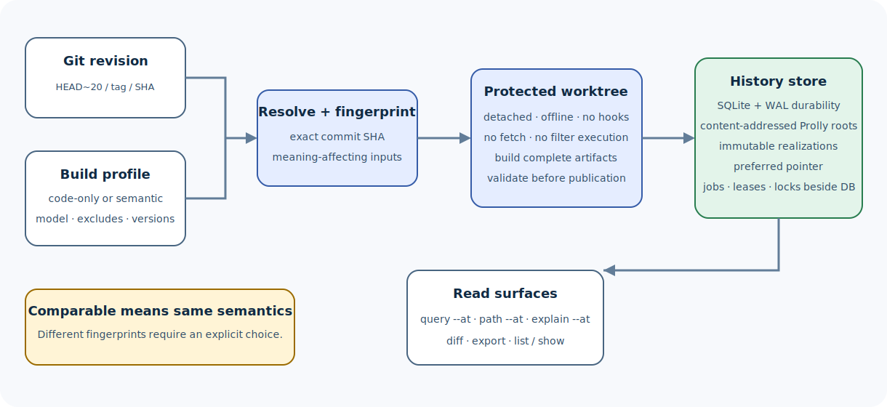

# Use versioned graph history

Compass history stores complete, immutable graph realizations for exact Git
commits in a SQLite-backed Prolly store outside normal Git history.

> **Who this guide is for:** maintainers comparing revisions, auditors,
> integrators needing reproducible snapshots, and contributors operating the
> history subsystem.
>
> **You will learn:** profiles, builds, lazy materialization, queries, diffs,
> exports, preferred realizations, maintenance, failure recovery, and safety
> boundaries.
>
> **Prerequisites:** a Git repository and a working `compass` binary.
>
> **Completion time:** 15–30 minutes plus extraction time.



## Mental model

```text
commit SHA + extraction fingerprint
                |
                v
         immutable realization
                |
                +-- graph structure
                +-- semantic/inferred edges
                +-- hyperedges
                +-- analysis and communities
                +-- reconstruction metadata
                `-- authoritative sidecars
```

A **realization** is more specific than a commit. The same commit can have a
code-only realization and one or more semantic realizations with different
provider/model configuration.

## 1. Inspect the command contract

Run:

```bash
compass history --help
compass diff --help
```

History commands include:

```text
enable   disable   status   build   rebuild
list     show      prefer   export  gc
```

Text output is for people. Commands that support `--format json` expose stable
machine-readable results.

## 2. Choose a repository-wide profile

### Code-only

For local structural code analysis without model credentials:

```bash
compass history enable --code-only
```

The profile includes the relevant build options and installs managed
`post-commit` and `post-merge` hooks for eager enqueueing.

### Semantic

Select a provider and model explicitly:

```bash
compass history enable --backend openai --model your-approved-model
```

Provider credentials come from the supported environment/configuration
surface. They are not included in the extraction fingerprint; provider/model
selection and other meaning-affecting options are.

Compass does not silently downgrade a semantic profile to code-only when
credentials are missing.

### What enable changes

`enable`:

- records the build profile for the repository;
- enables eager enqueueing;
- installs managed hooks;
- does not need to build every historical commit immediately.

Hooks capture the exact resulting commit and enqueue work durably, then return
without waiting for extraction.

## 3. Build an exact revision

```bash
compass history build HEAD
```

Use any locally resolvable Git revision:

```bash
compass history build v1.2.0
compass history build HEAD~20
```

The revision is resolved to a full commit SHA. Materialization runs in a
detached, protected, offline worktree:

- it does not include the caller's uncommitted files;
- it honors the committed `.gitignore`;
- it does not inherit caller-local `.git/info/exclude` or global ignore rules;
- it does not fetch;
- it does not prompt for credentials;
- it does not run hooks or checkout filters that could execute external code;
- it does not smudge LFS objects or recurse into submodules.

Gitlinks and LFS pointers are reported as limitations instead of being silently
expanded.

## 4. Inspect realizations

```bash
compass history status HEAD
compass history list HEAD
```

For automation:

```bash
compass history list HEAD --format json
```

Inspect one realization:

```bash
compass history show REALIZATION_ID
```

Look for:

- exact commit;
- realization ID;
- extraction fingerprint;
- completion and validation status;
- preferred state;
- artifact and renderer metadata.

Only a validated, complete realization can become the normal preferred result.

## 5. Query an exact revision

Read commands accept `--at`:

```bash
compass query "authentication flow" --at HEAD~20
compass explain TokenVerifier --at v1.2.0
compass path ApiHandler TokenVerifier --at HEAD~20
```

`--graph PATH` and `--at REV` are mutually exclusive.

If the preferred realization is missing, the command can synchronously
materialize it using the configured profile. This lazy behavior works even when
eager generation is disabled.

For exact CompassQL:

```bash
compass query --cql \
  "MATCH (n:Function) RETURN n.id LIMIT 100" \
  --at HEAD~20 \
  --format json
```

Record the resolved commit and realization identity beside saved results.

## 6. Compare revisions

Human-readable summary:

```bash
compass diff v1.2.0 HEAD
```

Detailed human output:

```bash
compass diff v1.2.0 HEAD --detailed
```

Machine-readable output:

```bash
compass diff v1.2.0 HEAD --format json
```

Topology-only comparison:

```bash
compass diff HEAD~1 HEAD --topology-only
```

The diff command supports explicit inclusion options for locations, analysis,
and metadata. Use `compass diff --help` for the exact current surface.

### Profile compatibility

Normal diffs require semantically comparable extraction fingerprints. If they
differ, Compass explains how to build a comparable realization:

```bash
compass history build NEW_REV --profile-from OLD_REV_OR_REALIZATION
```

`--allow-profile-mismatch` is an explicit inspection escape hatch. It does not
make unlike profiles equivalent.

### Reverse symmetry

A qualified diff should be deterministic and reverse-symmetric: additions from
A to B correspond to removals from B to A. The real-repository qualification
script exercises this contract.

## 7. Export a realization

Canonical graph JSON:

```bash
compass history export HEAD \
  --format graph-json \
  --output target/head-graph.json
```

Full Compass artifact directory:

```bash
compass history export HEAD \
  --format compass-out \
  --output target/head-compass-out
```

`compass-out` export restores authoritative non-derivable sidecars verbatim.
Derived reports and HTML are regenerated only with renderer versions recorded
in the artifact registry.

Export equivalence is semantic and canonical. JSON object or record ordering
that does not affect meaning is not a contract; graph structure, attributes,
multiplicity, duplicate id-less hyperedges, and authoritative bytes are.

## 8. Choose a preferred realization

When a commit has multiple valid realizations:

```bash
compass history prefer REV REALIZATION_ID
```

Preference is explicit. An unreadable preferred pointer is never silently
overwritten.

Recover a corrupt preferred realization only with:

```bash
compass history rebuild REV --replace-corrupt
```

This operation uses an explicit compare-and-swap observation so a concurrent
change is not blindly overwritten.

## 9. Understand shared storage

All linked worktrees share:

```bash
$(git rev-parse --git-common-dir)/compass/history.sqlite
```

The pinned SQLite adapter uses WAL mode, full synchronous durability, and a
busy timeout. Operational files—jobs, leases, locks, and protected temporary
worktrees—live beside the database rather than inside the Prolly values.

Safety rules:

- do not copy only `history.sqlite` while Compass is running;
- include WAL state in any live-database backup strategy;
- do not delete operational files to “unlock” a live process;
- allow Compass to create owner-only resource paths;
- use commands rather than editing Prolly keys or preferred pointers manually.

## 10. Garbage collection

Normal GC:

```bash
compass history gc
```

It retains every published realization and removes unreachable Prolly nodes
plus expired operational records.

Preview pruning of non-preferred realizations:

```bash
compass history gc --prune-non-preferred
```

Apply it explicitly:

```bash
compass history gc --prune-non-preferred --yes
```

Reported bytes and node rows are logical reclamation. GC does not promise that
the SQLite file shrinks and does not run `VACUUM`.

## 11. Disable eager generation

```bash
compass history disable
```

Disable is idempotent. It:

- stops eager enqueueing;
- keeps the database, jobs, and existing realizations;
- does not disable explicit `build` or `rebuild`;
- does not disable lazy `--at` or `diff`.

Use it when hooks should stop scheduling work without discarding history.

## Jobs, leases, and failures

The worker uses a durable FIFO queue and leases. A failed job does not prevent
later jobs from running.

Failure handling:

| Failure | Response |
| --- | --- |
| Provider credentials missing | Configure the selected semantic profile or build a code-only realization explicitly |
| Provider fails mid-build | Fix provider/network and rebuild; incomplete candidate cannot publish |
| Preferred realization fails validation | Inspect with `show`; use explicit rebuild/recovery path |
| Profiles differ during diff | Build with `--profile-from` or inspect explicitly with mismatch allowed |
| Live lease exists | Join/wait according to command behavior; do not delete lock files |
| Historical checkout limitation | Read the reported Gitlink/LFS/filter limitation and adjust source policy |
| Store copy is inconsistent | Restore a coherent SQLite/WAL backup; do not guess at Prolly records |

## Qualification

For two commits in a clean real repository:

```bash
scripts/qualify_history_real_repo.sh /path/to/repository OLD NEW
```

The harness:

- builds in an isolated shared clone;
- checks deterministic JSON;
- checks reverse-symmetric diffs;
- reopens the SQLite store;
- verifies topology filtering;
- requires topology-only diff to be at least twice as fast as full diff.

This is release evidence, not a substitute for application-specific validation.

## Related pages

- [Storage and history design](../design/storage-and-history.md)
- [History implementation](../implementation/workspace-tour.md)
- [Output reference](../reference/outputs.md)
- [Compatibility ledger](../../COMPATIBILITY.md)

**Next step:** enable a code-only profile in a disposable repository, build
`HEAD`, query it with `--at HEAD`, and inspect the resulting realization.
