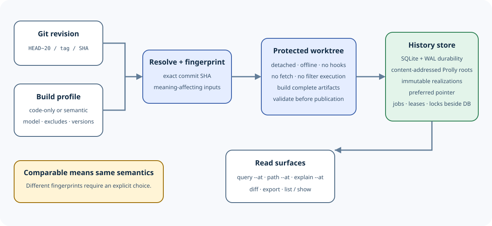

# Use versioned graph history

Compass history stores complete, immutable graph realizations for exact Git
commits in a SQLite-backed Prolly store outside normal Git history.



## Mental model

```text
commit SHA + extraction fingerprint
                |
                v
         immutable realization
                |
                +-- graph structure
                +-- semantic/inferred edges
                +-- hyperedges
                +-- analysis and communities
                +-- reconstruction metadata
                +-- committed source inventory
                `-- authoritative sidecars
```

A **realization** is more specific than a commit. The same commit can have a
code-only realization and one or more semantic realizations with different
provider/model configuration.

History graph schema `networkx-node-link/v1` records automatic multigraph
promotion. This release is a hard cutover for caches and operational state:
Compass starts the new `cache/v1` namespace empty and never imports or reads
legacy cache entries. The immutable realization schema itself is unchanged.

Before publication, Compass binds every detected code file to its exact Git
blob ID and requires an AST completion stamp in the extraction manifest. The
canonical `.compass_source_inventory.json` sidecar records that proof and
distinguishes files that legitimately produced no graph records. A missing
stamp fails closed instead of publishing an apparently complete graph.

## 1. Inspect the command contract

Run:

```bash
compass history --help
compass diff --help
```

History commands include:

```text
enable   disable   status   verify  build   rebuild
timeline change-counts diff list    show    prefer
export   cache         gc
```

Text output is for people. Commands that support `--format json` expose stable
machine-readable results.

## 2. Choose a repository-wide profile

### Code-only

For local structural code analysis without model credentials:

```bash
compass history enable --code-only
```

The profile includes the relevant build options and installs managed
`post-commit` and `post-merge` hooks for eager enqueueing.

### Semantic

Select a provider and model explicitly:

```bash
compass history enable --backend openai --model your-approved-model
```

Provider credentials come from the supported environment/configuration
surface. They are not included in the extraction fingerprint; provider/model
selection and other meaning-affecting options are.

Compass does not silently downgrade a semantic profile to code-only when
credentials are missing.

### What enable changes

`enable`:

- records the build profile for the repository;
- enables eager enqueueing;
- installs managed hooks;
- does not need to build every historical commit immediately.

Hooks capture the exact resulting commit and enqueue work durably, then return
without waiting for extraction.

## 3. Build an exact revision

```bash
compass history build HEAD
```

Use any locally resolvable Git revision:

```bash
compass history build v1.2.0
compass history build HEAD~20
```

Build the entire locally reachable history from a ref with one command:

```bash
compass history build main --all --code-only
```

By default this includes commits from merged branches. To build only the
first-parent lineage:

```bash
compass history build main --all --first-parent
```

The first request for an arbitrary, previously unseen revision is allowed to
perform one bounded detached-worktree extraction. Later revisions reuse the
repository-wide verified-content AST and Program cache, so unchanged files are
not parsed again.

Compass resolves the ref and build profile once, orders commits
parent-before-child, and processes them sequentially. A rerun seal-checks and
skips preferred realizations that already match the selected profile. Use
`compass history verify REV` when you need a full record-by-record integrity
scan. Failures
are recorded per commit without stopping later commits; the final report is
still produced and the command exits `1` if any commit failed. Progress is
written to stderr, while `--format json` writes one stable summary object to
stdout.

The revision is resolved to a full commit SHA. Materialization runs in a
detached, protected, offline worktree:

- it does not include the caller's uncommitted files;
- it honors the committed `.gitignore`;
- it does not inherit caller-local `.git/info/exclude` or global ignore rules;
- it does not fetch;
- it does not prompt for credentials;
- it does not run hooks or checkout filters that could execute external code;
- it does not smudge LFS objects or recurse into submodules.

Gitlinks and LFS pointers are reported as limitations instead of being silently
expanded.

## 4. Inspect realizations

```bash
compass history status HEAD
compass history list HEAD
```

For automation:

```bash
compass history list HEAD --format json
```

After a bulk build, omit the revision to verify all stored realizations:

```bash
compass history list --format json
```

Inspect one realization:

```bash
compass history show REALIZATION_ID
```

Look for:

- exact commit;
- realization ID;
- extraction fingerprint;
- completion and validation status;
- preferred state;
- artifact and renderer metadata.

Only a validated, complete realization can become the normal preferred result.

## 5. Query an exact revision

Read commands accept `--at`:

```bash
compass query "authentication flow" --at HEAD~20
compass explain TokenVerifier --at v1.2.0
compass path ApiHandler TokenVerifier --at HEAD~20
```

`--graph PATH` and `--at REV` are mutually exclusive.

If the preferred realization is missing, the command can synchronously
materialize it using the configured profile. This lazy behavior works even when
eager generation is disabled.

For exact CompassQL:

```bash
compass query --cql \
  "MATCH (n:Function) RETURN n.id LIMIT 100" \
  --at HEAD~20 \
  --format json
```

Record the resolved commit and realization identity beside saved results.

## 6. Compare revisions

Human-readable summary:

```bash
compass diff v1.2.0 HEAD
```

Expand routine symbol churn:

```bash
compass diff v1.2.0 HEAD --all
```

Raise the per-section display budget without expanding routine churn:

```bash
compass diff v1.2.0 HEAD --limit 50
```

Machine-readable output:

```bash
compass diff v1.2.0 HEAD --format json
```

For bounded graph-version counts used by timeline and IDE views, both
realizations must already exist:

```bash
compass history change-counts HEAD --parent HEAD~1 --format json
```

These are structural counts: source-coordinate shifts, clustering/layout
metadata, and anchor-derived edge IDs are collapsed, while node and edge
meaning, direction, relation, and multiplicity remain visible. Explicit
NetworkX multigraph keys remain authoritative: replacing one is reported as a
removal plus an addition, even when its endpoints and attributes are otherwise
equal.

The Rust history engine produces one canonical structural change stream
directly from the typed Prolly roots. Timeline counts, semantic diff records,
and the versioned graph view all consume that classification; the viewer does
not independently reinterpret storage identities. Edge reconciliation retains
at most one endpoint/relation group while streaming, cancels equal projected
occurrences as multisets, and deterministically pairs every remaining parallel
occurrence. This keeps work proportional to changed Prolly ranges plus the
largest changed parallel-edge group rather than reconstructing both graphs.

For an exhaustive record-level diff rather than a ranked semantic review, use
the history subcommand:

```bash
compass history diff v1.2.0 HEAD --format jsonl
```

It streams deterministic `header`, `change`, and `summary` records using schema
`compass.history.exact_diff/1`. Select roots when an integration only needs
part of the realization:

```bash
compass history diff v1.2.0 HEAD \
  --root nodes \
  --root edges \
  --output exact-topology-diff.jsonl
```

Available roots are `nodes`, `edges`, `hyperedges`, `analysis`, `metadata`,
`program-facts`, and `program-summaries`. Omitted roots are not opened. Output
files are written atomically and never overwritten. Stdout is bounded; use
`--output` for a very large exact diff.

Self-contained interactive reviewer report:

```bash
compass diff v1.2.0 HEAD \
  --format html \
  --output semantic-diff.html
```

Explain one finding:

```bash
compass diff v1.2.0 HEAD --explain sd1-...
```

The default report is ranked for PR review: likely breaks, behavior changes,
affected callers/modules, and test evidence come first. Routine symbol churn
is collapsed. Its five core concepts are contract changes, behavior changes,
dependency changes, affected consumers, and verification evidence. JSON uses
schema `compass.semantic_diff.report/1`; deterministic `sd1-...` finding IDs
make `--explain` and automation stable when the underlying semantic evidence
does not change. HTML embeds that complete JSON report and provides local
search, change-type filtering, routine-churn control, expandable evidence, and
analysis-completeness indicators without requiring a server. It also shows the
exact source patch and the meaningful code-graph delta in the same report. The
graph visualization focuses on the changed subgraph; its node/edge lists and
embedded JSON remain exhaustive.

In the graph view, select a changed node, inspect its incoming and outgoing
changed relationships, follow any related semantic findings, then open the
exact source patch when one is available. Connected nodes and edges remain
prominent while unrelated topology dims; clear the selection to restore the
whole sampled graph. The inspector can also follow relationships to nodes
outside the bounded visual sample, while the lists below retain every graph
change.

Finding details use symbol names in call explanations, witness paths, evidence,
and before/after summaries whenever the retained snapshots provide a name.
The embedded JSON keeps the stable identities and provides the corresponding
`entity_display_names` lookup.

Program IR v1 provides the richest behavior evidence. For graph-only languages,
Compass can also report changed branch conditions when an exact zero-context
source hunk overlaps the changed function's recorded line span. That evidence
is exact but deliberately marked as partial control-flow coverage; unrelated
body-hash changes remain indeterminate. Rebuild older realizations with the
current Compass binary before comparing them. Static test mapping may recommend
resolved test callers, but `partial` or `unknown` evidence never claims safety
or a test gap. AI-generated summaries and hosted PR delivery are outside this
deterministic MVP.

### Profile compatibility

Normal diffs require semantically comparable build profiles. If they
differ, Compass explains how to build a comparable realization:

```bash
compass history build NEW_REV --profile-from OLD_REV_OR_REALIZATION
```

There is no profile-mismatch override: unlike profiles do not produce a
semantic or exact report. Compass checks graph-engine compatibility explicitly
before comparing the complete build profiles.

## 7. Export a realization

Canonical graph JSON:

```bash
compass history export HEAD \
  --format graph-json \
  --output target/head-graph.json
```

Full Compass artifact directory:

```bash
compass history export HEAD \
  --format compass-out \
  --output target/head-compass-out
```

`compass-out` export restores authoritative non-derivable sidecars verbatim.
Derived reports and HTML are regenerated only with renderer versions recorded
in the artifact registry.

Export equivalence is semantic and canonical. JSON object or record ordering
that does not affect meaning is not a contract; graph structure, attributes,
multiplicity, duplicate id-less hyperedges, and authoritative bytes are.

## 8. Choose a preferred realization

When a commit has multiple valid realizations:

```bash
compass history prefer REV REALIZATION_ID
```

Preference is explicit. An unreadable preferred pointer is never silently
overwritten.

Recover a corrupt preferred realization only with:

```bash
compass history rebuild REV --replace-corrupt
```

This operation uses an explicit compare-and-swap observation so a concurrent
change is not blindly overwritten.

## 9. Understand shared storage

All linked worktrees share:

```bash
$(git rev-parse --git-common-dir)/compass/history.sqlite
```

The pinned SQLite adapter uses WAL mode, full synchronous durability, and a
busy timeout. Operational files—jobs, leases, locks, and protected temporary
worktrees—live beside the database rather than inside the Prolly values.

Safety rules:

- do not copy only `history.sqlite` while Compass is running;
- include WAL state in any live-database backup strategy;
- do not delete operational files to “unlock” a live process;
- allow Compass to create owner-only resource paths;
- use commands rather than editing Prolly keys or preferred pointers manually.

## 10. Garbage collection

Normal GC:

```bash
compass history gc
```

It retains every published realization and removes unreachable Prolly nodes
plus expired operational records.

Preview pruning of non-preferred realizations:

```bash
compass history gc --prune-non-preferred
```

Apply it explicitly:

```bash
compass history gc --prune-non-preferred --yes
```

Derived and extraction caches are disposable and have separate maintenance:

```bash
compass history cache status
compass history cache gc --max-bytes 1073741824
compass history cache gc --max-age-days 30 --yes
```

Cache GC is a dry run unless `--yes` is supplied. It never removes immutable
realizations. Semantic diff reports and historical viewer projections are
keyed by realization and engine/projection version; repeated reads therefore
avoid graph traversal.

Reported bytes and node rows are logical reclamation. GC does not promise that
the SQLite file shrinks and does not run `VACUUM`.

## 11. Disable eager generation

```bash
compass history disable
```

Disable is idempotent. It:

- stops eager enqueueing;
- keeps the database, jobs, and existing realizations;
- does not disable explicit `build` or `rebuild`;
- does not disable lazy `--at` or `diff`.

Use it when hooks should stop scheduling work without discarding history.

## Jobs, leases, and failures

The worker uses a durable FIFO queue and leases. A failed job does not prevent
later jobs from running.

Failure handling:

| Failure | Response |
| --- | --- |
| Provider credentials missing | Configure the selected semantic profile or build a code-only realization explicitly |
| Provider fails mid-build | Fix provider/network and rebuild; incomplete candidate cannot publish |
| Preferred realization fails validation | Inspect with `show`; use explicit rebuild/recovery path |
| Profiles differ during diff | Build the missing side with `--profile-from`; unlike profiles are not compared |
| Live lease exists | Join/wait according to command behavior; do not delete lock files |
| Historical checkout limitation | Read the reported Gitlink/LFS/filter limitation and adjust source policy |
| Store copy is inconsistent | Restore a coherent SQLite/WAL backup; do not guess at Prolly records |

## Qualification

For two commits in a clean real repository:

```bash
scripts/qualify_history_real_repo.sh /path/to/repository OLD NEW
```

The harness:

- builds in an isolated shared clone;
- checks deterministic JSON;
- checks reverse-symmetric diffs;
- reopens the SQLite store;
- verifies topology filtering;
- requires topology-only diff to be at least twice as fast as full diff.

This is release evidence, not a substitute for application-specific validation.

## Related pages

- [Output reference](../reference/outputs.md)
- [Command reference](../reference/commands.md)
- [Compatibility ledger](../../COMPATIBILITY.md)

**Next step:** enable a code-only profile in a disposable repository, build
`HEAD`, query it with `--at HEAD`, and inspect the resulting realization.
