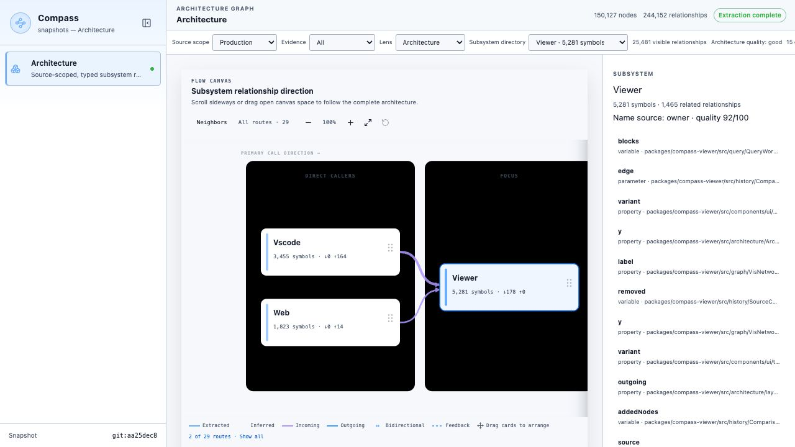
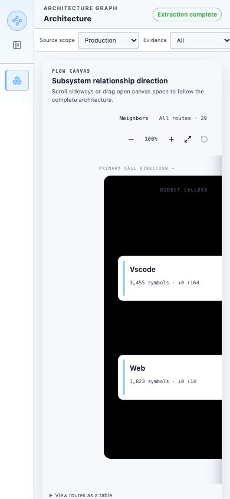

# Architecture graph hardening qualification

This report records the 2026-08-23 acceptance run for the architecture graph
hardening design. It uses Compass's own repository as the large real-world
corpus and the native Compass implementation only.

## Result

The architecture projection passed its fail-closed quality gate with schema
`compass.viewer.architecture/1` and status `good`.

| Measure | Before final hardening | Qualified result |
| --- | ---: | ---: |
| JSON payload | 154,410,683 bytes | 126,697,704 bytes |
| Production symbols | 110,285 | 34,039 |
| Largest Production group | Docs, 65,694 symbols | Viewer, 5,281 symbols |
| Largest-group fraction | 59.57% | 15.51% |
| Production groups retained | 6,547 | 2,651 |
| Fallback names | 0 | 0 |
| Unknown-source fraction | 0 | 0 |
| Quality | degraded | good |

The payload reduction is lossless: memberships use validated indexes into the
deterministically ordered node and group arrays. No group, symbol,
relationship, drill-down record, or omission count is discarded.

The key scope correction was making Documentation first-class. All-code keeps
the complete classified inventory:

| Source scope | Symbols |
| --- | ---: |
| Production | 34,039 |
| Test | 5,843 |
| Generated | 24,384 |
| Vendor | 9,615 |
| Documentation | 76,246 |
| Unknown | 0 |

Production grouping cannot observe the five non-production scopes. The
qualified Production overview has 15 of 42 owner groups shown, 27 exactly
disclosed as available in the directory, and 29 directed overview routes. The
default Architecture lens exposes 25,481 relationships. No automatic `Other`
group exists.

## Real-repository run

The cold native update analyzed 1,428 files and published 150,127 nodes,
244,152 relationships, and 8,086 communities. It completed in 293.25 seconds
with 3,132,129,280 bytes maximum resident set size. The JSON architecture
export completed in 75.23 seconds with 3,256,532,992 bytes maximum resident set
size. The bounded payload limit is 128 MiB; the qualified payload is
126,697,704 bytes.

The update disclosed that the underlying code graph omitted two nodes and
twelve edges. Architecture quality remains a separate signal and does not
reinterpret that extraction diagnostic.

## User-visible evidence

Wide standalone export:

Narrow responsive export:

The live browser acceptance check verified all of the following on the real
150,127-node export:

- `Extraction complete` is distinct from `Architecture quality: good`;
- project-specific names include Viewer, Vscode, Web, Languages, CLI, Query,
  Output, Resolve, Model, Graph, and Core;
- the UI reports `15 of 42 groups shown · 27 available in directory`;
- the subsystem directory contains all 2,651 retained groups; and
- the standalone HTML parses and renders without a contract error.

## Automated acceptance

The following gates passed:

- `cargo fmt --all -- --check`;
- `cargo clippy --workspace --lib --bins --locked -- -D warnings`;
- `cargo test --workspace --lib --bins --locked`;
- `cargo test -p compass-cli --test compass_product --locked`;
- `cargo test -p compass-cli --test viewer_export_cli --locked` (12 tests);
- architecture projection unit and qualification fixtures, including source
  isolation, identity stability, deterministic permutations, closed relation
  classes, hostile overlays, and explicit limits;
- `./scripts/qualify_code_graph_v1.sh --fixtures-only`, including all scale
  ceilings and byte-equivalence checks;
- `sh scripts/check_product_boundary.sh`;
- `npm run typecheck:js`;
- `npm run test:js`: 209 viewer tests, 141 VS Code tests, and 88 Chromium
  browser tests; and
- `node scripts/check_viewer_assets.mjs`.

The independent `scripts/qualify_architecture_graph.py` gate validated payload
size, schema, endpoint integrity, source-scope isolation, closed relation
classes, unique names, absence of `Other`, exact coverage and omission sums,
and quality status.

One unrelated pre-existing integration test remains red:
`compass-files --test contracts
build_guard_publishes_one_complete_snapshot_at_a_time` expects `graph-one` but
observes `graph-two`. The architecture change does not modify that build-guard
implementation or test. The required workspace lib/bin baseline is green.

## Acceptance conclusion

All six phases in the technical design are implemented. The architecture map
is derived from project evidence, source scope is fixed before grouping,
relationship meaning is explicit, omissions remain browsable rather than
invented topology, and quality is measured independently from extraction
completeness.

## Related pages

- [Architecture graph hardening technical design](architecture-graph-hardening-phased-technical-design.md)
- [Architecture discovery cookbook](../cookbook/architecture-discovery.md)
- [Output contracts](../reference/outputs.md)

**Next step:** use this report and its screenshots as the baseline for future
architecture-projection changes.
