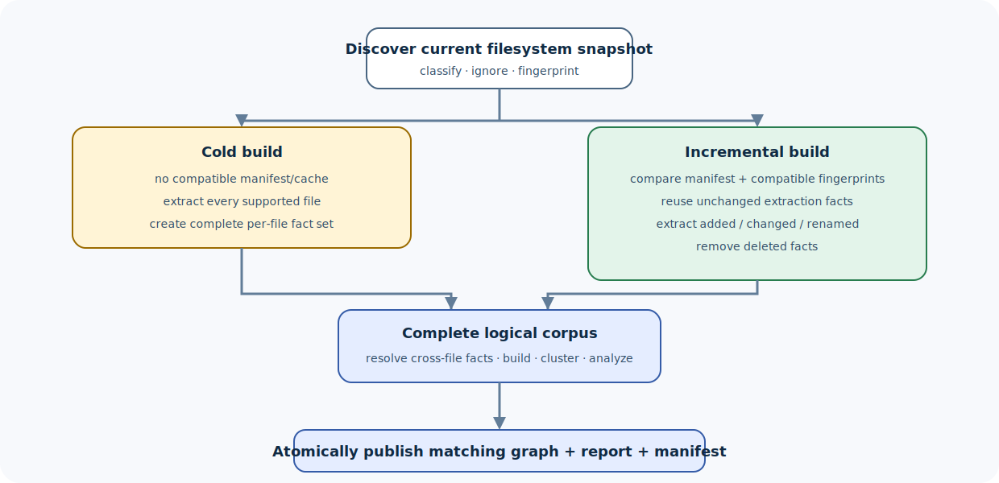

# Extraction pipeline implementation

The extraction pipeline turns a filesystem snapshot into a coherent graph
artifact set. This page follows the cold path, incremental path, and failure
boundaries through the owning crates.

> **Who this page is for:** contributors changing discovery, languages,
> resolution, graph construction, or output publication.
>
> **You will learn:** pipeline stages, core types, incremental invalidation,
> concurrency, semantic merge, and the tests required for safe changes.
>
> **Prerequisites:** [Workspace tour](workspace-tour.md).
>
> **Reading time:** 15–20 minutes.



## Entry points

At the CLI:

```text
compass update
compass extract
compass watch
```

`compass-cli` parses arguments into `compass-core::BuildOptions` and selects a
`BuildPurpose`. The core exposes:

```text
build_local_graph
build_graph_with_semantic
build_graph_with_layers
build_graph_with_layers_and_tiebreaker
```

The implementation keeps CLI display policy outside the core build transaction.

## Build options

Options cover:

- root and output directory;
- clustering and visualization;
- ignore and explicit exclusions;
- resolution and hub thresholds;
- force/cold versus incremental work;
- Cargo/PostgreSQL/Google Workspace inputs;
- semantic provider, model, mode, budget, concurrency, timeout;
- partial and deduplication policy;
- timing.

Not every option affects every stage. Meaning-affecting options must be
represented in fingerprints or manifest compatibility where reuse could
otherwise produce a wrong graph.

## Stage 1: detect

`compass-files::detect` walks the requested root under `DetectOptions`.

It returns classified files and incremental information:

```text
source code
project/config manifests
semantic documents/media
integration shortcuts
ignored or unsupported paths
```

Important invariants:

- paths stay within the scan root;
- file kinds are deterministic;
- ignore policy is explicit;
- watch filters use compatible classification;
- very large or invalid inputs fail at the owning boundary.

## Stage 2: compare with the manifest

The current manifest and stat/content fingerprints divide files into:

```text
unchanged
changed
added
renamed
deleted
```

An unchanged file can reuse cached extraction when:

- content/fingerprint matches;
- cache format matches;
- parser/extractor configuration matches;
- relevant project-wide inputs have not invalidated it.

A file-local cache is only one input. Cross-file resolution and graph analysis
still operate on a complete logical set.

## Stage 3: parse and extract files

`compass-languages::Registry` maps a file to a `LanguageSpec` and extractor.
The engine produces an `Extraction`:

```text
nodes
edges
hyperedges
raw calls / language facts
```

File work can run in parallel. To keep results deterministic:

- collect facts in stable source order where ordering is contractual;
- give nodes stable IDs;
- avoid global mutable parser state;
- keep errors associated with source paths;
- separate parsing from project-wide resolution.

### What belongs in an extractor

An extractor should emit evidence available from that file and its explicit
local/project metadata:

- declarations and containment;
- imports/re-exports;
- calls and references with unresolved facts as needed;
- source locations;
- relation context and provenance;
- language-specific identifiers.

It should not pick one arbitrary project-wide target when evidence is
ambiguous.

## Stage 4: optional integration fragments

Configured sources can add extractions:

- Cargo dependency graph;
- PostgreSQL schema;
- Google Workspace shortcuts;
- SCIP data;
- documents/media after semantic extraction.

Every integration returns graph-compatible records and remains bounded at its
I/O boundary.

## Stage 5: resolve

`compass-resolve` merges per-file facts and resolves:

- module/import targets;
- JavaScript re-exports;
- cross-file calls;
- members and receiver types;
- language-specific call facts;
- colliding IDs;
- header/implementation pairs;
- unique placeholders.

The resolver owns project-wide evidence. It marks derived relations
appropriately and preserves ambiguity when a unique target cannot be justified.

Peak-memory paths use ownership transfer (`resolve_owned_with_root`) so large
per-file buffers are appended/dropped rather than cloned.

## Stage 6: graph build and deduplication

`compass-graph` combines resolved extractions into a `GraphDocument`.

It:

- maps facts to node-link records;
- enforces direction;
- preserves parallel edges where required;
- removes only duplicates allowed by the compatibility contract;
- applies entity deduplication;
- optionally uses a semantic tiebreaker where explicitly configured;
- records graph-level metadata.

Deduplication must not merge two same-labeled but distinct entities merely for
a smaller graph.

## Stage 7: semantic merge

The core can receive a `SemanticLayer`. The semantic pipeline:

1. reads bounded units;
2. packs chunks;
3. invokes the selected backend;
4. parses and validates untrusted JSON fragments;
5. binds evidence and normalizes IDs;
6. records partial/completeness status;
7. merges results with structural facts.

Provider failure or invalid fragments must not publish a complete semantic
graph. `--allow-partial` is an explicit policy change, not silent recovery.

## Stage 8: cluster and analyze

`compass-graph`:

- clusters nodes into communities;
- computes community cohesion/signatures;
- remaps communities stably for incremental output where possible;
- identifies god nodes and surprising connections;
- suggests questions;
- detects import cycles;
- generates data for reports.

`--no-cluster` can isolate deterministic AST behavior in qualification, but the
normal user artifact includes analysis when enabled.

## Stage 9: render

`compass-output` converts the graph and analysis to:

- graph JSON;
- Markdown report;
- optional HTML;
- requested export sidecars.

Derived output should not change graph identity. A renderer change can still
affect historical artifact registries and must be versioned when reproducible
reconstruction depends on it.

## Stage 10: publish

`compass-files` atomic helpers and build guards publish the new artifact set.

Required behavior:

- no successful marker for incomplete work;
- no partial JSON replacing a valid graph;
- diagnostics identify the source/stage;
- manifest advances only with the graph it describes;
- disposable cache failure does not redefine graph truth.

## Incremental update correctness

The fast path is correct only if it produces a graph equivalent to a clean
rebuild for the same inputs.

Cases to test:

| Change | Expected invalidation |
| --- | --- |
| edit function body | changed file extraction plus affected resolution/analysis |
| add file | new extraction and project merge |
| delete file | remove its nodes/edges and re-resolve dependents |
| rename file | path/ID/import effects handled |
| change manifest | project metadata and dependent resolution invalidated |
| change ignore rule | corpus membership recalculated |
| parser/extractor version | incompatible caches invalidated |
| semantic profile change | semantic cache/profile invalidated |

Performance qualification compares cold, warm unchanged, single-file change,
rename, and delete cases against the frozen oracle.

## Watch mode

`compass-core::watch_local_graph` combines compatible watch filtering,
debouncing, and the update pipeline.

Watch correctness requires:

- no missed relevant path;
- no infinite loop on generated `compass-out/`;
- coalesced bursts;
- observable failure;
- clean shutdown;
- optional polling fallback.

The one-shot update remains the recovery oracle.

## Error propagation

Keep stage context:

```text
FileError        discovery/read/write/cache
language error   parse/extract source
CoreError        orchestration/completeness
DedupError       graph identity conflict
semantic error   provider/parse/validation
output error     rendering/publication
```

The CLI maps these to useful stderr and exits. Avoid stringifying too early.

## Verification for a pipeline change

At minimum:

1. smallest unit fixture for the new fact or invalidation;
2. cold build artifact check;
3. unchanged warm update;
4. changed/renamed/deleted cases if relevant;
5. graph equivalence against a clean rebuild;
6. direction, relation, provenance, attributes, and multiplicity assertions;
7. malformed/oversized/interrupted input failure;
8. CLI stdout/stderr/exit/output-tree test;
9. parity fixture if the behavior is in the compatibility ledger;
10. performance qualification if the hot/cold pipeline changes.

## Related pages

- [How Compass works](../concepts/how-it-works.md)
- [Workspace tour](workspace-tour.md)
- [Semantic pipeline](semantic-pipeline.md)
- [Performance qualification](../../PERFORMANCE.md)

**Next step:** trace one fixture from detection through its `Extraction`, then
inspect the resolved edge and final `graph.json` record.
